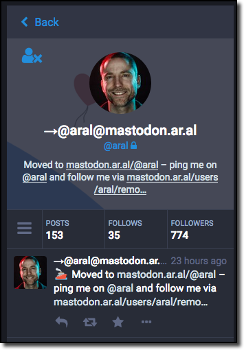

Het grote verschil tussen Mastodon en bijvoorbeeld Twitter is het gebruik van de *instances*. Dit zijn losstaande servers waar een kopie van de Mastodon software op draait. Elke server heeft zijn eigen installatie en elke beheerder van deze installatie kan zelf de regels bepalen voor zijn Mastodon-instantie.
Net als met email diensten kun je op al die instanties een account aanmaken. Zo heb ik een email account bij Gmail, bij Protonmail en bij Outlook. Dat zijn dus drie instanties waar ik een identiteit heb.

Ik kan op verschillende Mastodon servers een account aanmaken, zoals ik mailadressen aanmaak. Ze staan los van elkaar en zijn apart van elkaar te gebruiken. Sterker nog, zoals ik met mijn Protonmail naar Gmail kan mailen en vice versa, zo kan ik met gebruikersaccounts op verschillende Mastodon servers met mezelf praten en mezelf volgen.

Maar hoe weet de buitenwereld op welk Mastodon adres ik het meest actief ben? Op dit moment is er niet één strategie of manier om dat te achterhalen. Het is aan de eigenaar van de accounts om dat zelf vorm te geven. Hier zijn wat ideeën die je kunt gebruiken.

## Maak je actieve account "verified"

Ga naar de instellingen van je meest actieve account en zet een checkmark achter je naam. Inderdaad. Een ✅. Een kleine *fuck-you* naar het ingewikkelde en ondoorzichtige verificatie-proces van Twitter waar niemand nu exact wist hoe en wanneer je dat vinkje zou krijgen. Met deze emoji geef je aan dat dit je actieve account is.

## Verwijs de inactieve accounts naar de actieve

Ik heb [een tweede account](https://mastodon.network/@frankmeeuwsen) op een ander netwerk. Ik doe daar niets mee, maar heb het aangemaakt als backup voor mijn actieve account. Ik weet nog niet of de huidige instantie Mastodon.social mijn langdurige verblijfplaats gaat zijn. Misschien verhuis ik naar een andere instantie omdat de lokale tijdlijn daar gewoon leuker is. Maar tot die tijd meld ik in gebruikersnaam dat het een inactief account is en in de bio link ik naar mijn actieve account. Omdat ik het in de gebruikersnaam meld zal dit ook in zoekresultaten op het netwerk zichtbaar zijn en zo voor nieuwe volgers duidelijker wat mijn actieve account is. Zie bijvoorbeeld het resultaat van de zoekopdracht naar het account van Adam Curry. Ik twijfel welke van de twee ik zou moeten hebben. Misschien moet ik ze allebei volgen? Maar een kleine hint zou al kunnen helpen welk account het meest actief is.

## Doe iets met je avatar

Bij bovengenoemde account heb ik eveneens de avatar aangepast. Op Mastodon kun je een animated gif als avatar maken. Met een glitch-app heb ik een kleine storing in de avatar aangebracht zodat je al een idee hebt dat er iets mee aan de hand is. Maar je kunt natuurlijk vanalles doen met je avatar. Hou er rekening mee dat je avatar en gebruikersnaam in zoekresultaten zichtbaar zijn, dus daar kun je van profiteren om duidelijk te maken wat je actieve account is.

## Promoot één actief account op andere kanalen.

Op mijn Twitter account noem ik mijn actieve account. Als ik ergens schrijf over Mastodon dan noem ik mijn actieve account. Natuurlijk is dat laatste minder makkelijk te wijzigen in publicaties van anderen. Maar je moet roeien met de riemen die je hebt.

## Alle bovenstaande

Doe gewoon alles wat hier staat en nog zul je mensen krijgen die je op inactieve of andere accounts gaan volgen. So be it. Het is allemaal nog wat rafelig aan de randen en we zoeken allemaal nog naar de juiste vorm. Verwacht niet dat alles in één keer netjes en gepolijst werkt. Spullen gaat stuk, werken niet, doen andere dingen dan je verwacht. Ben er niet bang voor maar beweeg mee.

Lost dit het probleem op van meerdere identiteiten?

Ik begin me af te vragen of dat eigenlijk wel een probleem is... Want als ik weer de vergelijking met e-mail maak, het is nu heel normaal om naar iemand mailadres te vragen. En afhankelijk wie ik tegenover mij heb krijgen ze mijn zakelijke mailadres, persoonlijke mailadres, of "ik hoef je meuk niet" mailadres. Ik heb meerdere Twitter accounts onder mijn hoede. Op Instagram doe ik andere dingen dan op Facebook en onder een andere naam. Toch is dat allemaal geen probleem. Waarom zou het dan op Mastodon ineens wel een probleem zijn?

Trouwens, al die mailadressen konden [vroeger niet eens met elkaar praten](https://medium.com/musings-meanderings/mastodon-isnt-the-end-of-twitter-it-s-the-begining-5581bd6ec7b5). Pas toen het POP en SMTP protocol kwamen gingen de deuren wagenwijd open. Een soort van federatie rondom e-mail...

Om de analogie met mail dan even verder te trekken, ik kan in een mailapplicatie als Thunderbird prima de berichten van meerdere accounts binnenhalen en per bericht kiezen vanuit welk account ik dit verstuur. Wellicht dat zoiets ook voor Mastodon en GNU/Social mogelijk gaat worden. Je hebt een primair account waar je actief op bent, maar soms wil je juist iets zakelijks delen op de private tijdlijn van een eigen instantie. Waarna je weer hobbymatig iets deelt op een andere instantie.

De vraag is of we het probleem moeten oplossen dat iemand meerdere identiteiten kan hebben. Dat is namelijk geen probleem maar de realiteit. We moeten denken over en bewegen naar een manier om op een fluïde en natuurlijke manier met die identiteiten te bewegen over meerdere netwerken/instanties waarbij het je eigen verantwoordelijkheid is dat deze identiteiten jou werkelijk representeren.

Lijkt me niet te moeilijk.

## Update: Zo kan het ook

Zie dit screenshot van het account van Aral Balkan. Drie duidelijke aandachtspunten over zijn verhuizing naar een ander account

1. Zijn username is gewijzigd in zijn nieuwe account URL met een pijl, wat verwijst naar een verhuizing
2. Zijn bio aangepast met direct duidelijkheid dat hij is verhuisd
3. Een laatste toot met een link naar zijn nieuwe account.

Vind ik netjes.
