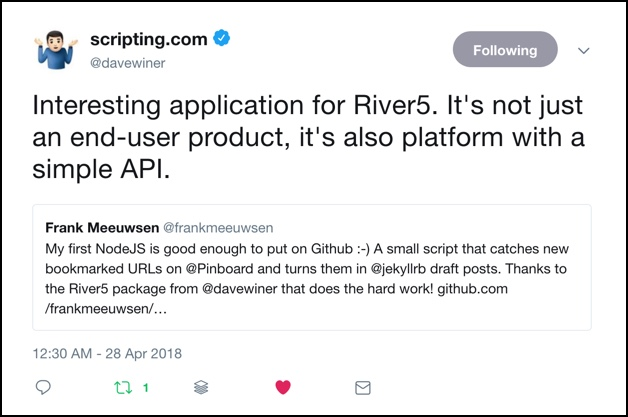

Een van de principes in het Indieweb-denken is ["selfdogfood"](https://indieweb.org/selfdogfood), het idee dat je bouwt wat je zelf nodig hebt en gebruikt wat je zelf bouwt. Dit in tegenstelling tot de vele diensten die het werk uit handen nemen in de vorm van plugins, betaalde SaaS oplossingen of software waarvan je eigenlijk niet exact weet wat er achter de schermen gebeurt.

Mijn eigen vertaling van dit principe is om te proberen eigen oplossingen te bedenken voor relatief kleine vraagstukken. Als die dan leiden tot de goedkeuring van de *godfather of blogging*, dan is mijn week al weer goed!

## Bouw op wat er al is
Vorige week beschreef ik [het proces](/dogfood/) hoe ik een eigen oplossing wilde maken om op dit blog links te delen zonder de overhead van het maken van een complete blogpost in een editor. Het zou bijna zo eenvoudig moeten zijn als het delen van een link op Twitter. Om het geheugen nog eens op te frissen, mijn idee bestaat uit vier stappen:

1. Ik deel iets op Pinboard of Inoreader met een speciale tag en tekst
2. Op een eigen server hou ik deze RSS feeds bij
3. Als er een nieuw item verschijnt in de feeds, zorg ik dat deze omgezet wordt in een artikel voor dit blog
4. Op gezette tijden publiceer ik automatisch een nieuw link-item op dit blog.

Stap 1 had ik al in orde, stap 2 en 3 kan ik eveneens afvinken nu! Sinds gisteren heb ik [werkende code](https://github.com/frankmeeuwsen/diggingthelinks) op Github staan die voortborduurt op de ideeën van de [vorige post](/dogfood/). Het interessante van het complete proces is dat de hoeveelheid code die ik zelf heb geschreven minder is geworden omdat een hoop van het harde werk is verdwenen achter de schermen. Ik schreef vorige week al:
> Dus ga ik dan toch overstag en hack ik mijn eigen ideeën in de DaveReader of ga ik nog even door met mijn eigen oplossing?

Ik ben uiteindelijk overstag gegaan. Omdat het simpelweg de beste oplossing was. Ik kwam er al puzzelend achter dat ik in de vorige versie van dit script veel werk reproduceerde wat al aanwezig was in de broncode van de [DaveReader package](https://github.com/scripting/reader). Toen ik een avond wat zat te spelen met de River5 code van Winer, waar de genoemde reader in zit, vielen er ineens wat puzzelstukjes op hun plek. [River5](https://github.com/scripting/river5) is een consumentenproduct volgens Dave, al durf ik dat wel tegen te spreken. Het is niet een app die je even installeert en _it just works_. Echter, als ontwikkelplatform is het best interessant kwam ik achter. River 5 is een simpele _River of news_ applicatie, waar je nieuwe blogposts en ander nieuws als een stroom voorbij ziet komen. Inderdaad, zoals Twitter en Facebook werken, maar dan in eigen beheer en met bronnen die je zelf in beheer hebt. [Zie hier een voorbeeld](http://radio3.io/rivers/).

De applicatie komt met een aantal ingebouwde mogelijkheden om zelf iets te kunnen doen met nieuwe items die vanuit een RSS feed binnenkomen. In de code van de reader [zit een voorbeeld](https://github.com/scripting/reader/tree/master/examples/feedFiler) van Dave, waar binnenkomende items in een feed lokaal worden opgeslagen in JSON formaat. Toen vielen er plots wat puzzelstukjes in elkaar. 

## 72 regels code

Ik bedacht me dat ik de River 5 applicatie prima kan gebruiken zonder de webinterface die je hierboven ziet. In de River 5 applicatie zit eigenlijk alles wat ik nodig heb: 

* Het kan de feeds opslaan die ik wil bijhouden voor mijn links
* Het kan periodiek de laatste items ophalen
* Het heeft ingebouwde functies om _iets_ met die nieuwe items te doen

Zoals Dave al zegt in [zijn tweet](https://twitter.com/davewiner/status/989995345408135169) en [blogpost](http://scripting.com/2018/04/27.html#a225327), ik gebruik River 5 niet als product, maar als API voor RSS feeds. 

Zo'n helder moment zorgt er dan voor dat ik binnen een avond de code kon maken die doet wat ik wil. Ik hergebruikte oudere code om het Markdown template te vullen, dat had ik eerder deze week al als losse functie geschreven en getest. Ik wist alleen nog niet wáár in de logica ik het moest gebruiken. Nu vielen in een paar uur alle stukjes in elkaar. De [72 regels code die je hier ziet](https://github.com/frankmeeuwsen/diggingthelinks/blob/master/index.js) zijn niet op die ene avond geschreven. Maar het is het voorlopige eindpunt van een week puzzelen, proberen, leren en fouten maken. Ze doen het dubbele dan de [75 regels](https://github.com/frankmeeuwsen/pinboard/blob/master/index.js) van een week eerder en ze hebben me weer meer geleerd _waarom_ bepaalde code iets doet. 

## Volgende stappen

Inmiddels werkt de code en worden er templates weggeschreven met links die ik nog eens wil delen op mijn blog. Nu is het tijd voor twee nieuwe vraagstukken:

1. Kan ik een Node JS applicatie draaien op dezelfde server als mijn blog?
2. Hoe ga ik er voor zorgen dat de concept-posts daadwerkelijk op gezette tijden worden gepost en welke logica ga ik hiervoor gebruiken?

Voor beiden ben ik al iets verder in mijn denken dan alleen de vraag stellen. 

### Node op Github
Mijn blog draait op [Github Pages](https://pages.github.com/). Dit is gratis webruimte die je krijgt bij een Github account. Heel mooi en prima om een compleet statische blog op te draaien. Maar Github Pages komt begrijpelijk met een aantal beperkingen. Zo kun je er niet alle [plugins](http://planetjekyll.github.io/plugins/) gebruiken die in de Jekyll-community aanwezig zijn. En het is niet mogelijk om een NodeJS applicatie permanent te laten draaien op de server. Nu kan ik twee kanten op, ik zet het Node script op een andere server bij Digital Ocean, waar ik eveneens mijn statistieken onderbreng en ik zorg voor een koppeling tussen die server en Github Pages. Of ik ga alles bij Digital Ocean onderbrengen. 

De keuze valt logischerwijs op de laatste. Het is eenvoudiger om alles op één locatie te hebben in mijn optiek, al betekent dat wel weer een nieuw project. De migratie naar Digital Ocean.

### Logica
Voor mijn tweede vraag, hoe zorg ik dat concept-posts netjes over de dag heen worden gepubliceerd, daar ben ik nog niet helemaal zeker van. Als ik het goed begrijp kan Jekyll de concepten op het juiste moment publiceren als de datum in de post in de toekomst ligt (de zogenaamde [_frontmatter_](https://jekyllrb.com/docs/frontmatter/)). Ik heb dat echter nog niet goed genoeg getest om er zeker van te zijn dat het zo werkt. Ik kan dan concepten maken met een datum en tijdstempel die steeds verder in de toekomst ligt. 
Een ander scenario is om concept-posts te maken zonder datum en tijd en door middel van een [cronjob](https://nl.wikipedia.org/wiki/Cronjob) op de server steeds de oudste post te kiezen, de datum in de frontmatter te herschrijven naar de huidige datum en tijd en dan te publiceren. 
Kortom: Zit de publicatie-logica bij het opslaan van het concept of bij het publiceren van het concept?

Beiden zijn volgens mij valide wegen die naar het einddoel gaan, de vraag is welke weg de minste beren heeft. Ik vermoed de laatste, omdat ik dan geen routine hoef te schrijven om steeds een datum in de toekomst te selecteren. Een cronjob is relatief eenvoudig te schrijven met sites als [Crontab Guru](https://crontab.guru/every-1-hour), waarna ik me alleen maar hoef te concentreren op het kopieren van een bestaand bestand naar een andere map en het vervangen van de datum in dat bestand. Dat hoeft niet heel lastig te zijn.

## Conclusies

Een paar eerste conclusies na deze eerste stappen in de wereld van NodeJS:

* Het is geen enorm moeilijke taal. Omdat het Javascript is, waar ik al wat eerdere ervaring mee heb, kan ik relatief makkelijk instappen en de code lezen. 
* Voor mij nieuwe concepten als asynchrone en synchrone functies, _promises_ en callbacks zijn nog lastig te doorgronden. Ik maak soms wat _leaps of faith_ in mijn code en ik vertrouw er op dat het klopt wat ik doe
* Wat ik interessant vind in mijn leercurve is dat ik van een behoorlijke berg code uiteindelijk weer ben teruggegaan naar het uitbesteden van relevante stappen in mijn project. Het ophalen van de feed en het bepalen wat er moet gebeuren als er iets nieuws binnen is gekomen, dat bestaat al. De creativiteit zit in wát er moet gebeuren. 
* Aan de zijlijn van dit ontwikkeltraject heb ik ontdekt dat ik nog veel heb te leren over het opzetten van een goede ontwikkelomgeving. Met software, plugins en instrumenten die het ontwikkelen en testen van scripts een stuk eenvoudiger maken. Daar mag ik nog wel meer tijd en onderzoek aan besteden. 

Binnenkort meer over mijn [ongelooflijke avontuur wat weer is gestart](http://incredibleadventure.nl)! 😉