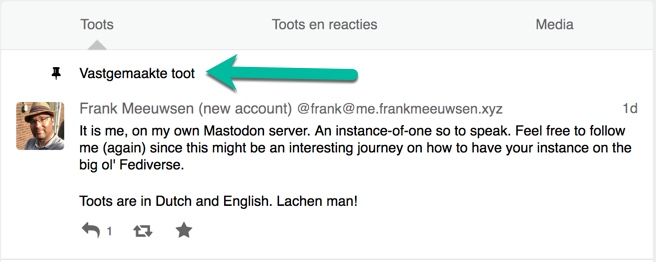
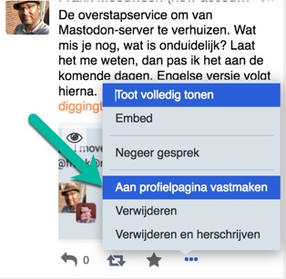
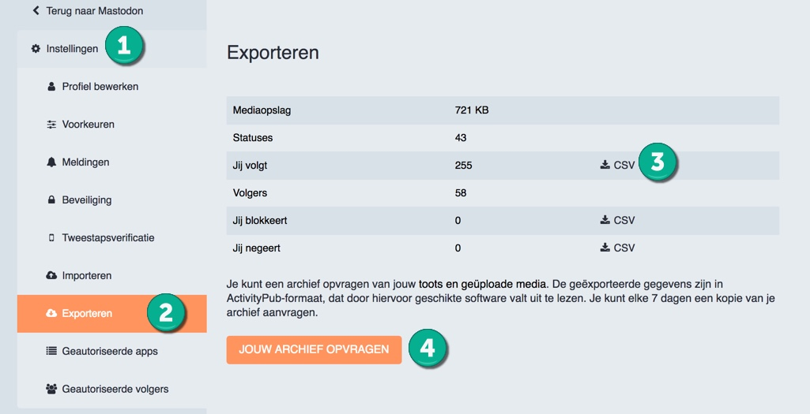
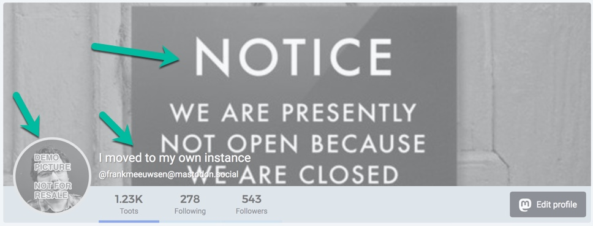
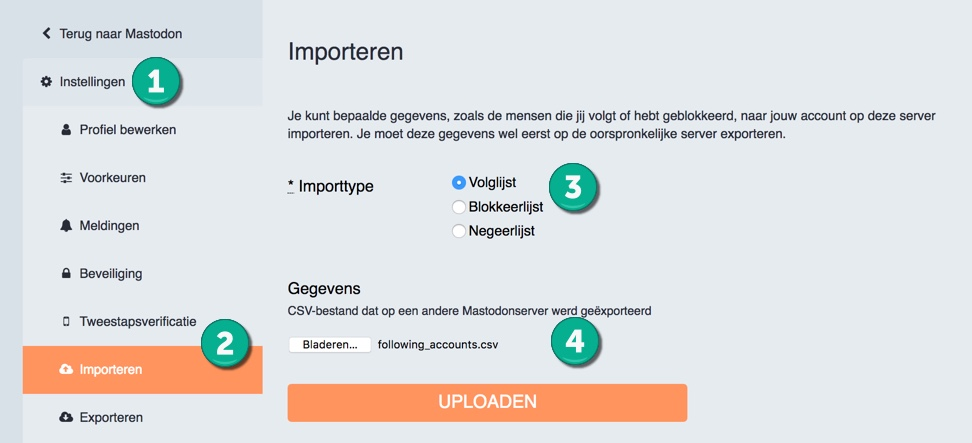
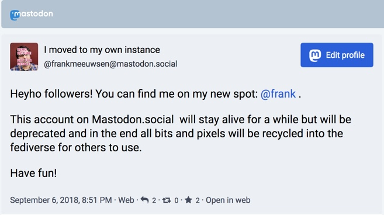
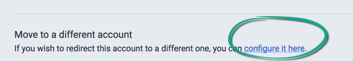
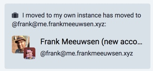

Een bijzonder maar gelijktijdig lastig te bevatten concept van [Mastodon](/Mastodon/) is dat het niet uit één centraal netwerk bestaat. Dit in tegenstelling tot de grote en bekende netwerken. Als je een Twitter-account hebt, dan kun je hiermee met andere mensen op Twitter communiceren. Met een Twitter-account kun je niet iets op Facebook plaatsen. Je kunt op je LinkedIn account de tweets niet lezen. Al deze netwerken zijn gesloten van elkaar en wisselen in de basis geen berichten met elkaar. Bij Mastodon is dat anders. Je kunt een plek kiezen ergens in het Mastodon-universum, de Fediverse. Een plek die je prettig vindt of waar je je thuis voelt vanwege de gelijkgestemden die er zijn. 

### Wat is een instance
Ik gebruik de termen Mastodon-server en Mastodon-instance door elkaar. Op Twitter logt iedereen in op Twitter.com om op het netwerk. Op Mastodon log je in op een specifieke instance. Mastodon bestaat uit meerdere punten in een netwerk die met elkaar zijn verbonden. Al deze punten zijn een "instance" of een "server".
Als je op een Mastodon-server zit, zoals [Mastodon.social](https://mastodon.social) (de grootste) of [Mastodon.nl](https://mastodon.nl) (Een Nederlandse versie), dan kun je de mensen daar volgen. Maar je kunt tegelijkertijd met dat account allerlei andere mensen volgen die op andere servers zitten. 

Dat betekent dat je van server naar server kunt verhuizen, mocht je dat willen. Je neemt je eigen volgers-lijst mee zodat je constant iedereen kunt blijven volgen terwijl je zelf naar andere servers verhuist. Het is echter wel lastig voor degenen die jou volgen. Want op dit moment is het niet mogelijk dat jouw volgers mee verhuizen en je automatisch op je nieuwe account gaan volgen. Daar moet je nog wel wat werk voor doen. 

## Verhuizen op Mastodon
Ik begon op Mastodon op de grootste server, [Mastodon.social](https://mastodon.social). Ik was altijd wel benieuwd of een andere server me meer zou brengen. Maar eerlijk gezegd heb ik nog niet dé plek gevonden waar ik mijn account wil onderbrengen. Plus de onhebbelijke drang om te experimenteren met sociale netwerken, zorgde er voor dat ik [een eigen Mastodon-server](/Nieuw-Mastodon-account/) ben gestart. Voor mij alleen. Dat maakt op zich niet uit, ik kan door het decentrale karakter van Mastodon nog altijd mensen volgen die op andere instances zitten. 

De verhuizing is tevens een experiment. Hoe gaat dat in zijn werk en welke stappen kan ik zetten om een zo groot mogelijke groep te bereiken? Daarom heb ik deze stappengids geschreven. Onderstaand vind je stap voor stap wat ik heb gedaan. Doe er je voordeel mee, misschien kun je met minder stappen af. Of komt er nog een extra stap bij. Laat het me weten op [Mastodon](https://me.frankmeeuwsen.xyz/@frank) en ik pas deze gids aan!

### Voorbereiding: Twee tabbladen
Het voordeel van verhuizen naar een andere Mastodon instance is dat je prima op beide instances kunt zijn ingelogd. Omdat ze een verschillende domeinnaam hebben zitten de twee accounts elkaar niet in de weg. Zorg er dus voor dat je op zowel je oude als je nieuwe account bent ingelogd in twee tabbladen.

### 1. Nieuw account: Header en avatar in orde gemaakt
Het eerste wat ik heb gedaan op mijn nieuwe account, nog voor ik iemand ging volgen, is de header, avatar en bio in orde gemaakt. Ik heb deze exact gelijk gemaakt aan het bestaande oude account zodat daar geen verwarring over kan bestaan. Verderop lees je hoe ik deze onderdelen bij het oude account juist heb aangepast om aan te geven dat ik ben verhuisd. 

### 2. Nieuw account: Introductie

Ik heb een nieuwe introductie geschreven als toot (het equivalent voor de tweet op Mastodon) op mijn nieuwe account. Deze heb ik direct vastgepind bovenaan mijn profiel. Zo zien mijn bestaande volgers direct dat ze op een nieuw account van me kijken, waarna ze kunnen besluiten om me wel of niet (opnieuw) te volgen.

Je kunt een toot bovenaan je profiel vastmaken via de drie puntjes bij elk bericht. Kies vervolgens "Aan profiel vastmaken"

### 3. Nieuw account: Gebruikersnaam

Mijn gebruikersnaam is gewoon mijn voor- en achternaam. Ik heb geen alter-ego of verborgen naam op veel netwerken. Ik hou het graag duidelijk voor anderen die mij willen volgen. Je kunt natuurlijk zelf elke gebruikersnaam kiezen die je wilt. Mastodon heeft geen *Real Names policy* zoals bijvoorbeeld Facebook. Wat ik wel heb toegevoegd achter mijn naam is ***"(new account)"***, om de eerste paar dagen duidelijk te maken dat dit een nieuw account is.

### 4. Oud account: Followerslijst gedownload

Op mijn oude account heb ik onder Instellingen > Export mijn lijst met Followings/volgers gedownload. Dit is de lijst met accounts die ik zelf volg en die ik uiteraard wil blijven volgen op mijn nieuwe account. Als nodig kun je eveneens je bloklijst en negeerlijst downloaden. Dit zijn prima leesbare bestanden, dus na downloaden, open ze gerust in een teksteditor om te zien wat voor accounts er zoal zijn vermeld. De lijsten heb je zometeen nodig op je nieuwe account. 
Je kunt eveneens je volledige archief opvragen met alle berichten die je via je oude account hebt verzonden. Je kunt deze (nog?) niet importeren in je nieuwe account, maar je kunt het altijd bewaren als een backup of herinnering wat je ooit op Mastodon hebt geplaatst.

### 5. Oud account: Avatar aangepast

Op mijn oude account pas ik nu mijn avatar aan. Ik heb een ouder avatar gebruikt met een tekst. Maar je kunt natuurlijk allerlei avatars gebruiken om duidelijk te maken dat je niet meer actief bent op het account. Je kunt een zwart-wit avatar gebruiken, of een wat blurry foto.

### 6. Oud account: Header aangepast
Net als de avatar pas ik de header aan naar een beeld wat duidelijk maakt dat ik niet meer op het account actief ben. Er zijn genoeg stockfoto's of andere beelden te vinden die je kunt gebruiken. Of je maakt zelf iets. Laat je creativiteit de vrije loop!

### 7. Oud account: Gebruikersnaam en bio aangepast
Tenslotte heb ik mijn gebruikersnaam aangepast naar "I moved to my own instance" en in de bio wederom de link gezet naar mijn nieuwe account. De gebruikersnaam is direct zichtbaar als je op mijn oude accountnaam zoekt of in de lijst met volgers kijkt. De bio geeft direct een hint waar mijn nieuwe account is. 

### 8. Nieuw account: Importeren followerslijst

Vervolgens heb ik op mijn nieuwe account de eerder gedownloade lijst met volgers weer geïmporteerd. Dit doe je op je nieuwe account via Instellingen > Import. Kies als Importtype de "volglijst" en selecteer de lijst die je hebt gedownload. Klik op Upload. Het mooie is dat iedereen die ik opnieuw ga volgen een melding krijgt van het volgen. Omdat ik in een eerdere stap (new account) aan mijn gebruikersnaam heb toegevoegd zien mijn volgers direct dat het om een nieuw account gaat. Als ze naar mijn accountpagina gaan zien ze eveneens de _pinned toot_ waar ik uitleg geef. 

### 9. Oud account: Post naar nieuwe account

Op mijn oude account post ik nog één bericht, waar ik verwijs naar mijn nieuwe account. In dat bericht kun je natuurlijk schrijven wat je wilt. Ik heb gemeld dat het nu nog in leven blijft maar uiteindelijk zal verdwijnen. Vervolgens heb ik met mijn _nieuwe_ account nog een antwoord gegeven op het bericht, waardoor het er onder verschijnt. Nog een plek waar mensen mijn nieuwe account zien en de mogelijkheid hebben om te volgen.

### 10. Oud account: Move optie in settings

Als laatste actie schakel ik de ingebouwde optie in van Mastodon. Onder Instellingen > Profiel bewerken vind je helemaal onderaan de mogelijkheid om je account te migreren. Dat doet niets van het bovenstaande, het geeft je oude accountpagina een grijze overlay, alsof het inactief is en op de pagina staat "(je oude username) has moved to (je nieuwe username)". Met wederom een link naar je nieuwe pagina.

Je kunt natuurlijk een aantal stappen overslaan. Je hóeft het niet allemaal te doen. Je zou alleen de laatste optie kunnen doen, de verhuis-optie aanzetten in je account. Mijn ervaring met bovenstaande stappen is dat de meeste actieve Mastodon-gebruikers me binnen 24 uur op mijn nieuwe account zijn gaan volgen. Als je de cijfers goed bekijkt, heb ik nu 10% van de volgers op mijn nieuwe account ten opzichte van het oude account. Is dat een ramp? Nou nee. Want die 90% zit allang niet meer op Mastodon en waren niet actief. Dus geen gemis. 

Heb jij nog tips hoe je de verhuizing tussen Mastodon accounts vlekkeloos laat verlopen? Ik hoor het graag van je, natuurlijk op [Mastodon](https://me.frankmeeuwsen.xyz/@frank)!

### Headerbeeld
<a style="background-color:black;color:white;text-decoration:none;padding:4px 6px;font-family:-apple-system, BlinkMacSystemFont, &quot;San Francisco&quot;, &quot;Helvetica Neue&quot;, Helvetica, Ubuntu, Roboto, Noto, &quot;Segoe UI&quot;, Arial, sans-serif;font-size:12px;font-weight:bold;line-height:1.2;display:inline-block;border-radius:3px;" href="https://www.pexels.com/photo/building-metal-house-architecture-101808/" target="_blank" rel="noopener noreferrer" title="Download free do whatever you want high-resolution photos from PhotoMIX Ltd."><svg xmlns="http://www.w3.org/2000/svg" style="height:12px;width:auto;position:relative;vertical-align:middle;top:-1px;fill:white;" viewBox="0 0 32 32"><title>logo</title><path d="M20.8 18.1c0 2.7-2.2 4.8-4.8 4.8s-4.8-2.1-4.8-4.8c0-2.7 2.2-4.8 4.8-4.8 2.7.1 4.8 2.2 4.8 4.8zm11.2-7.4v14.9c0 2.3-1.9 4.3-4.3 4.3h-23.4c-2.4 0-4.3-1.9-4.3-4.3v-15c0-2.3 1.9-4.3 4.3-4.3h3.7l.8-2.3c.4-1.1 1.7-2 2.9-2h8.6c1.2 0 2.5.9 2.9 2l.8 2.4h3.7c2.4 0 4.3 1.9 4.3 4.3zm-8.6 7.5c0-4.1-3.3-7.5-7.5-7.5-4.1 0-7.5 3.4-7.5 7.5s3.3 7.5 7.5 7.5c4.2-.1 7.5-3.4 7.5-7.5z"></path></svg>PhotoMIX</a>