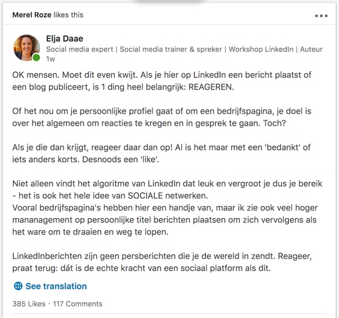
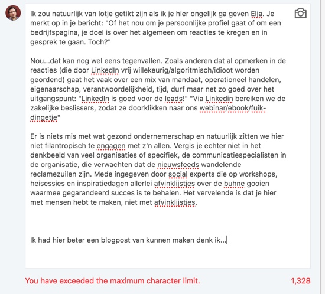

Hey [Elja](https://www.eljadaae.nl/)!

Ik wilde zo graag mijn verhaal kwijt als reactie op [je LinkedIn post](https://www.linkedin.com/feed/update/urn:li:activity:6443721136013393921), maar helaas laat het netwerk me maar een beperkt aantal karakters toe. Daarom, [naar goede traditie](/linkedin-antwoord/), hier mijn eigenlijke reactie. Voor hen die geen LinkedIn hebben of de post niet kunnen zien, hieronder een screenshot van Elja's opmerking over reageren op LinkedIn.

Mijn reactie:
>Ik zou natuurlijk van lotje getikt zijn als ik je hier ongelijk ga geven Elja. Je merkt op in je bericht: "Of het nou om je persoonlijke profiel gaat of om een bedrijfspagina, je doel is over het algemeen om reacties te kregen en in gesprek te gaan. Toch?"

>Nou...dat kan nog wel eens tegenvallen. Zoals anderen dat al opmerken in de reacties (die door LinkedIn vrij willekeurig/algoritmisch/idioot worden geordend) gaat het vaak over een mix van mandaat, operationeel handelen, eigenaarschap, verantwoordelijkheid, tijd, durf maar net zo goed over het uitgangspunt: "LinkedIn is goed voor de leads!" "Via Linkedin bereiken we de zakelijke beslissers, zodat ze doorklikken naar ons webinar/ebook/fuik-dingetje"

>Er is niets mis met wat gezond ondernemerschap en natuurlijk zitten we hier niet filantropisch te engagen met z'n allen. Vergis je echter niet in het denkbeeld van veel organisaties of specifiek, de communicatiespecialisten in de organisatie, die verwachten dat de nieuwsfeeds wandelende reclamezuilen zijn. Mede ingegeven door social experts die op workshops, heisessies en inspiratiedagen allerlei afvinklijstjes over de buhne gooien waarmee gegarandeerd succes is te behalen. Het vervelende is dat je hier met mensen hebt te maken, niet met afvinklijstjes.
>Ik had hier beter een blogpost van kunnen maken denk ik...

Wat dan bij deze weer is gedaan...

PS: Wat ik dan wel weer vreemd vind, hoe kan [deze reactie](https://www.linkedin.com/feed/update/urn:li:activity:6443721136013393921) wel worden geplaatst? Dat zijn toch minstens evenveel karakters...

