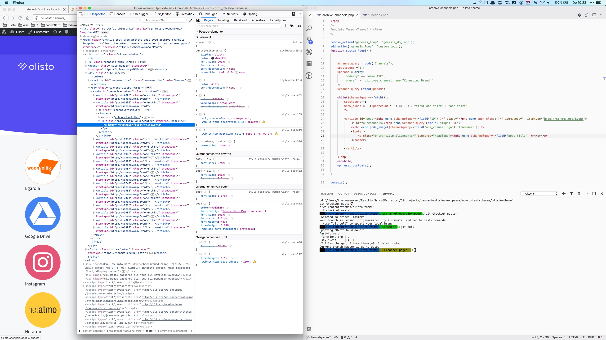

De afgelopen weken ben ik behoorlijk _deep down_ in een project bij Olisto. Omdat we geen eigen team hebben voor de website én omdat we een redelijk _bootstrapped_ bedrijf zijn (dus er is weinig tot geen budget) heb ik een tijdelijke nieuwe taak. Onze site heeft een flinke opfrisbeurt nodig omdat we onze diensten wat gaan verleggen. Daarbij was het nodig om de achterkant van de site (WordPress) eens goed op te schonen na alle lapmiddelen van de afgelopen twee jaar. 

Dus heb ik samen met Patrick Loonstra de schone taak om de site van een nieuwe motor en een nieuwe carosserie te voorzien. Dat betekent dat we ons de afgelopen weken in een sneltreinvaart hebben verdiept in onderwerpen als:

* [Git](https://git-scm.com/book/en/v2) en versiebeheer, vooral in samenwerking met ieder eigen taken (*git rebase* anyone?)
* CSS [Grid](https://css-tricks.com/snippets/css/complete-guide-grid/) en [Flexbox](https://css-tricks.com/snippets/css/a-guide-to-flexbox/)
* PHP en WordPress ontwikkeling
* [Vagrant](http://vccw.cc/) en Ansible Playbooks voor lokale webontwikkeling
* SVG en CSS

En allerlei kleine klusjes die er tussendoor bij komen waar je voor het minste of geringste al een zoekvenster bij pakt. 

Mijn scherm ziet er al een tijdje zo uit. 

Hopelijk over een week of wat is het weer wat rustiger!