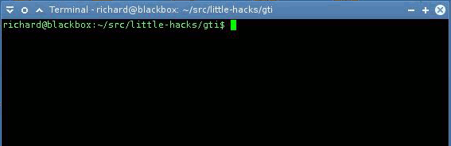

De laatste weken werk ik veel in terminal en leer ik zienderogen hoe het versiebeheer van git werkt. Op de _commandline_ gebruik je veel je toetsenbord, wat op langere termijn een enorme tijdswinst boekt. Vooral als je weet wat je moet typen. Om git te gebruiken begin je elk commando met `git`. Nu typ ik wel eens te snel en dan staat er `gti`. Er zijn 1001 manieren om dit op te lossen, ik heb [deze optie](http://r-wos.org/hacks/gti) gekozen. Zodat ik in elk geval steeds een glimlach op mijn mond heb bij elke foute toetsaanslag én het script automatisch het juiste commando voor me maakt.

