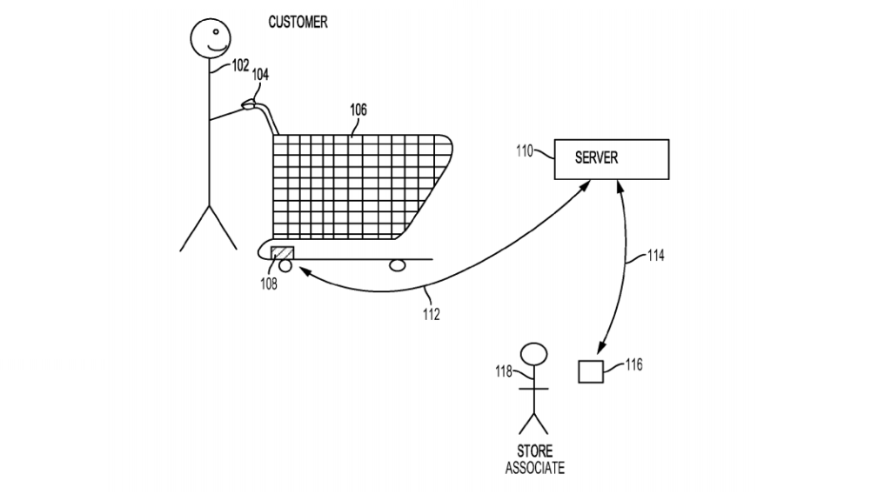

Supermarktketen Walmart heeft een nieuw patent ingediend. Ze willen met biometrische handvatten aan winkelwagens hun klanten in de gaten houden. Aan de hand van de hartslag, temperatuur en stess-niveau. 

Zoals de keten [zelf claimt](https://www.cbinsights.com/research/walmart-patent-biometric-shopping-cart/): 

>The data would be used to help identify shoppers in distress and to improve their overall shopping experience.

In [het patent](http://pdfaiw.uspto.gov/.aiw?docid=20180240554&PageNum=1&&IDKey=F4F1B5839ACE&HomeUrl=http://appft.uspto.gov/netacgi/nph-Parser?Sect1=PTO1%2526Sect2=HITOFF%2526d=PG01%2526p=1%2526u=/netahtml/PTO/srchnum.html%2526r=1%2526f=G%2526l=50%2526s1=20180240554%2526OS=%2526RS) maken ze duidelijk dat het vooral gaat om op afstand klanten te identificeren die hulp nodig hebben, zich niet zo goed voelen of een verhoogde temperatuur hebben. Een nobel initiatief van een supermarkt. Maar gelijktijdig gaan er overal alarmbellen af. Het patent claimt geen persoonlijke informatie op te slaan, maar dat is voor een supermarkt niet nodig. 
Een idee als dit kan prima verder worden uitgewerkt naar een commercieel aantrekkelijke situatie: 

Ik kom in de supermarkt, scan een klantkaart waarmee ik word geïdentificeerd. Met een zelfscanner is de koppeling te maken tussen mijn winkelprofiel en de handvatten van de winkelwagen, waarmee biometrische data wordt opgevangen. 

Tijdens de duur van de boodschappen kan een slim lerend systeem (real-time data, externe data, eerder winkelbezoek, mogelijk andere variabelen) vrijwel direct zien hoe ik reageer op specifieke berichten in de winkel. Of dat nu om een schap-advertentie gaat, een aanbieding of een notificatie op de zelfscanner dat ik een aanbieding laat liggen.
Je hebt vrijwel geen controle over je neuro-fysische reacties en een marketeer met dergelijke technologie en een verzameling data van voldoende klanten kan daar slim gebruik van maken. 

Vaak worden patenten ingediend als bescherming van een idee, niet om het direct tot uitvoer te brengen. Ik hoop dat dit in de idee fase blijft. Anders zal ik toch vaker met dikke handschoenen aan door de gangpaden van een supermarkt mijn karretje besturen...