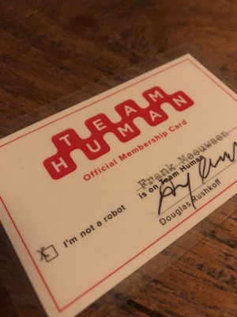
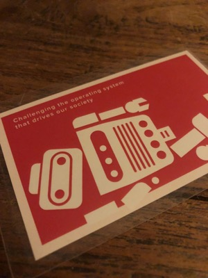

Een beter "I am not a robot" captcha bewijs kun je je niet wensen dan wat ik gisteren in de analoge brievenbus ontving.

 

Team Human is de wekelijkse podcast van schrijver en media-activist [Douglas Rushkoff](https://medium.com/s/douglas-rushkoff). Je kent hem wellicht als de bedenker van de term *viral media* en *digital native*. Hij is zelf niet altijd even happig om het toe te geven, wat blijkt als je periodiek naar zijn podcast [Team Human](https://teamhuman.fm/) luistert. 

In elke aflevering heeft hij een gast met wie hij zo'n 50 - 70 minuten praat hoe technologie ons gedrag als mens beïnvloedt. Ben je lid van Team Human, dan zit je in het non-binaire kamp. In het kamp die de algoritmische beïnvloedingscultuur van Silicon Valley afwijst en streeft naar een maatschappij waar technologie ons dient in plaats van (ver)leidt. 

## De maatschappelijke invloed van Netflix
Een [recente episode](https://teamhuman.fm/episodes/ep-102-danah-boyd/) met danah boyd verhaalt over de kracht van technologie om onze vooroordelen te versterken, hoe een netwerk anders is dan een community, maar eveneens hoe real-time digitalisering van media je gedrag verandert. Ze illustreert dit mooi aan de hand van Netflix. 

In de begindagen was Netflix een DVD-distributeur. Je kon online een lijst bijhouden van DVD's die je wilde zien en als ze beschikbaar waren, dan kreeg je er een toegestuurd. Over het algemeen representeerden deze lijsten wie je zou _willen_ zijn. Met andere woorden, op de lijst staan films die je zou willen zien in een ideale situatie. Maar meer dan eens kwam de art-house film of gelauwerde Oscar-nominatie bij je thuis in een envelop en bleef hij twee weken liggen "want nu even niet". Waarna je hem terugstuurde, al dan niet bekeken. De aanbevelingen van Netflix waren gebaseerd op deze data. Het gaf ze wel een idee welke films populair waren, maar natuurlijk hadden ze geen idee hoe lang men naar een film keek, óf hij wel werd bekeken en welke scenes wellicht vaker werden bekeken. Het algoritme van de analoge Netflix was nog niet geperfectioneerd en werd gevoed door wensen in plaats van waarheid.

Dat veranderde toen Netflix de ommekeer maakte naar hoe we ze nu kennen, een schier onuitputtelijke online bron van TV-series, films, blockbusters, herinneringen uit je jeugd en experimenten uit eigen keuken. Ineens was het niet meer noodzakelijk om te wachten tot je gewenste film binnen kwam. Je klikt op een titel en je hebt instante bevrediging. Nog altijd zou een film als "12 years a Slave" in de ranglijsten staan, maar al snel werd duidelijk dat "RuPaul's Drag Race" minstens zo populair is, zo niet met mijlen voorsprong. Een aantal jaar geleden schreven ze een wedstrijd uit om het aanbevelings-algoritme verder te optimaliseren. Dat zorgde voor een aardverschuiving in hun kennis en aanbevelingen. Door ons veranderende gedrag naar een realtime bevrediging van je entertainment behoeften, gevoed door een algoritme wat je tot op de seconde kan volgen wat je doet en voor welke genres en afbeeldingen je gevoelig bent, maakt het Netflix tot de _powerhouse_ die het nu is. 

De technologie geeft ons meer "wat we willen" in plaats van "wat goed voor ons is". Ik zal niet betwisten dat zo nu en dan een avond flauwe comedies bingewatchen erg lekker kan zijn, maar trek  het eens door naar het macro-beeld van technologie-bedrijven die sturen op winst-maximalisatie voor de aandeelhouders in plaats van nut-optimalisatie voor hun gebruikers. We reageren helaas beter op het rode bolletje met likes en gemiste tweets dan op de volgende longread van een krant. 

Dit is slechts één voorbeeld hoe op individueel niveau technologie je voedt en bedient, maar tegelijkertijd een maatschappij vorm geeft op grotere schaal. Hoe onze individuele gedragingen door technologie worden uitvergroot, geaggregeerd en doorvertaald in besluiten met een kapitalistisch motief in plaats van een maatschappelijk belang. 

## Abonnee-gedreven
Dat is wat Team Human doet. Het bevecht het besturingsysteem van de maatschappij, bevraagt het algoritmisch gedreven surveillance-kapitalisme en zoekt naar het non-binaire menselijke geluid in een wereld die door software wordt opgegeten. 

Douglas Rushkoff noemt zijn show "The last best hope for humanity" 
De podcast is advertentievrij, maar is [afhankelijk van donaties](https://teamhuman.fm/support/). Als dank ontvang je de mooie abonnementskaart, in januari volgt het nieuwe gelijknamige boek van Rushkoff. Tevens is er een groeiende community van luisteraars die elkaar via het forum vinden, zijn er live opnames (in de US, da's dan wel jammer) en kun je inbellen bij opnames als je een vraag hebt. 

Ben je op zoek naar een ander geluid in de kakefonie van online marketing podcasts, nieuwe technologie trends en verdieping van het dagelijkse nieuws? Dan is [Team Human](https://teamhuman.fm/) zeker de moeite van het luisteren waard. 

