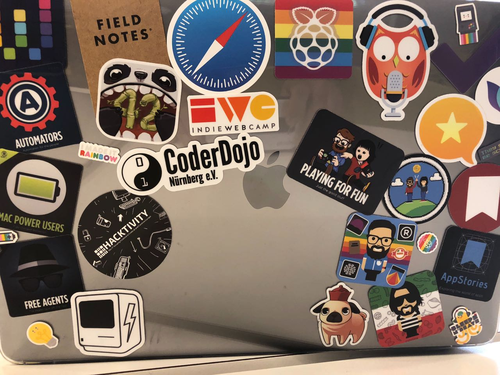
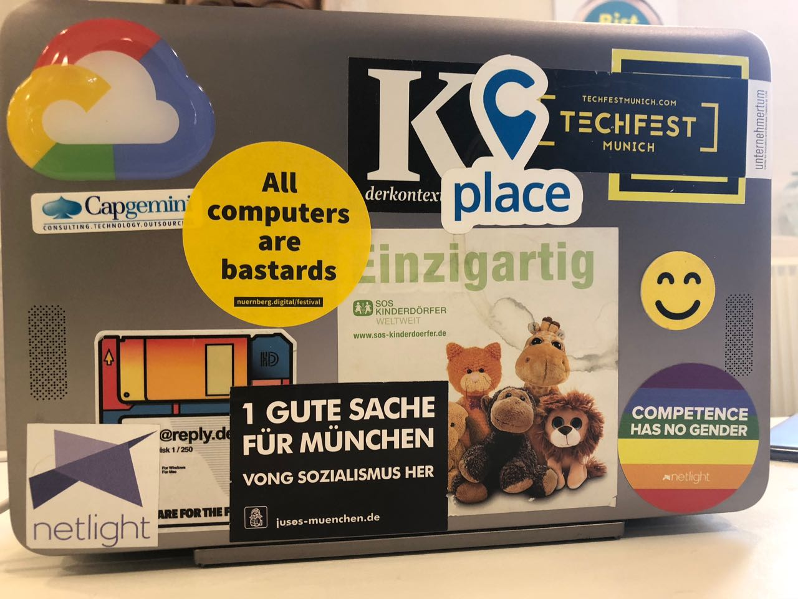
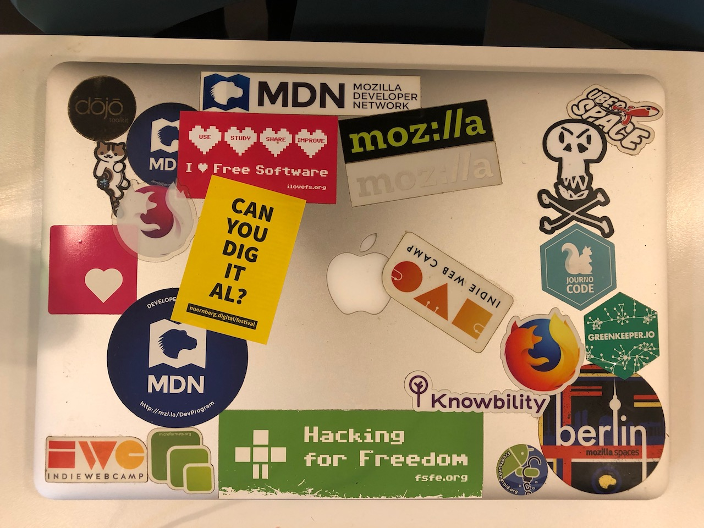
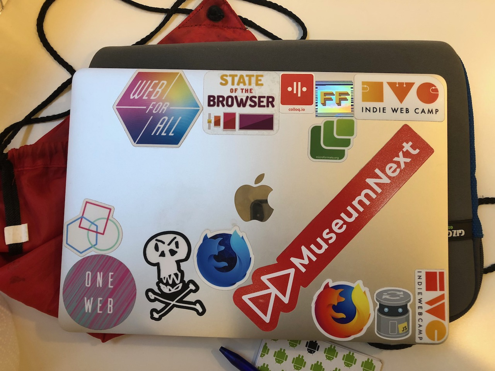
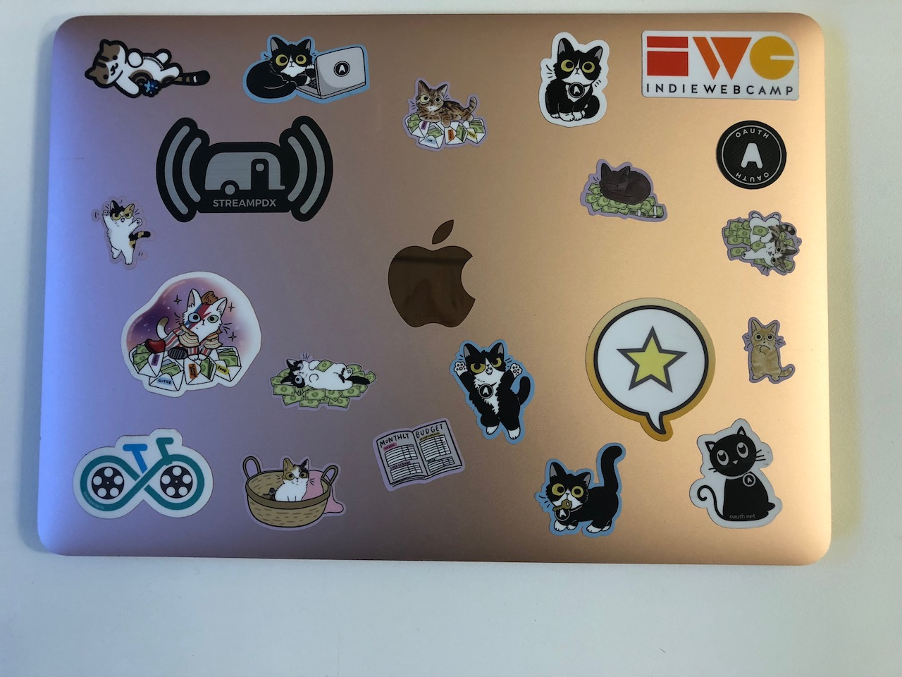

Als iets herkenbaar is aan mensen die werkzaam zijn in de digitale industrie als _maker_, dan is het vaak hun apparatuur. Niet eens of het een Mac is of een Windows laptop. Maar veel meer wat er op die laptop is geplakt.

Tijdens deze IndieWebCamp viel het me weer op, velen hebben hun laptop bestickerd met bewijzen van bezochte tech-conferenties, liefdesuitingen voor een specifieke browser, servertaal of programmeerrichting, memes, favoriete tech-producten en politieke voorkeuren. Een paar voorbeelden van de vaak fraaie laptopcases die ik tegenkwam.

