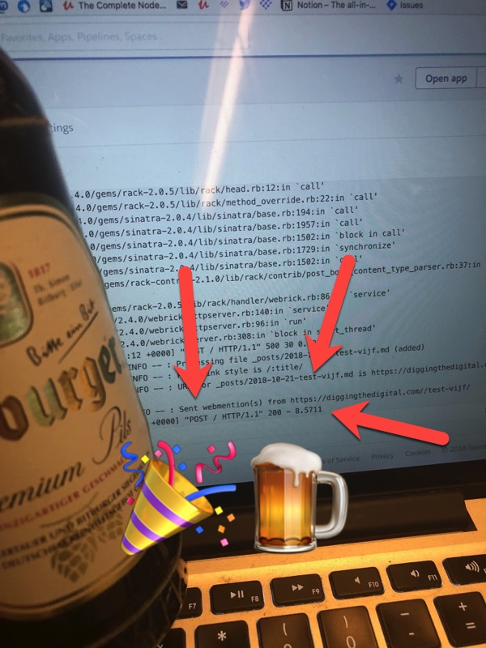

Test vijf hoor jongens: Terwijl [Ton Zijlstra](https://www.zylstra.org/blog/2018/10/solvingwebmentions/) en ik onderweg zijn in de trein vanuit Nurnberg naar Utrecht kijken we de livestream van de demo's die tijdens de IndieWebCamp zijn geproduceerd. Tegelijkertijd kreeg ik een melding dat het eerdergenoemde script om webmentions te sturen is geupdate naar een nieuwe versie naar aanleiding van mijn opmerking in de Github repository. Dus nu is de ultieme test. Ik stuur deze blogpost inclusief wederom een link naar de [Webmention testtool](https://webmention.rocks/test/2). En ik ben benieuwd wat er gaat gebeuren....

**Update**: Het werkt! Hoera! Check de bovenstaande blogpost van Ton en je ziet mijn blogpost daar als reactie staan. Dát zijn dus webmentions. Ik kan nu reageren op blogposts met een eigen blogpost. Dit is wat ik echt voor elkaar wilde krijgen met deze IndieWebCamp en dat is me dus gelukt. Al is het in de trein op de terugweg en kost het me mijn EU maandbundel van T-Mobile. Maar ik ben een blij ei nu! Ik vier het meteen met een Bitburger!

