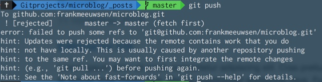

Dit blog is mede ontstaan omdat ik beter wilde begrijpen hoe het versiebeheersysteem Git en de bekende dienst [Github](https://github.com/frankmeeuwsen/DTD-Blog) werken. Door de jaren heen en na veel proberen en testen begin ik inmiddels wel te begrijpen wat de belangrijkste manieren zijn om met git te werken. Afgelopen week belandde ik in een situatie waar ik niet dacht dat het versiebeheer me zou kunnen helpen. Toch is dat gebeurd en het is de moeite waard om hier de uitleg te geven. Hopelijk kunnen anderen er zo in de toekomst weer profijt van hebben.

**Let op:** Wat nu volgt is een wat technisch verhaal over de werking van het git versiebeheer. 

### De situatie
Toen ik met dit blog begon schreef ik alles vanaf mijn laptop in tekstbestanden. Die bestanden staan op één centrale plaats op mijn laptop en als de blogpost lokaal klaar is, stuur ik hem naar Github met een paar commando's. 
Daar bouwt Github Pages de website op en presenteert hem. Dat is wat je hier en nu ziet. 

De afgelopen maanden zijn de mogelijkheden toegenomen om dit blog vanaf andere plaatsen te updaten. Zo kan ik steeds eenvoudiger via mijn iPhone een update schrijven en publiceren met de app [Editorial](https://omz-software.com/editorial/), even zo goed als ik dat via een Firefox extensie [Omnibear](https://www.omnibear.com) kan doen. Hiermee benader ik de huidige situatie van moderne blogsystemen zoals WordPress, waar je op verschillende manieren een post op je blog kunt zetten.

Er is echter een groot verschil tussen WordPress en mijn systeem. Bij WordPress staat alles op één centrale plaats in een database, ergens op een server ergens op het internet. In mijn situatie is de centrale plaats Github, waar alle blogposts in Markdown zijn opgeslagen. Maar die centrale plaats is niet altijd gesynchroniseerd met mijn lokale versie van deze site. Nu kan zich de volgende situatie voordoen:

* Ik schrijf een blogpost via de Omnibear extensie. 
* Deze wordt op Github opgeslagen en de site wordt opnieuw opgebouwd en gegenereerd. 
* Vervolgens schrijf ik iets via mijn laptop en ik synchroniseer dat met Github. 
* De site wordt weer opnieuw opgebouwd en gepresenteerd.
* Maar op de een of andere manier wordt de eerste post dan verwijderd, inclusief de geschiedenis die Github normaal opslaat in de _commit-history_.

Kort gezegd, als ik er niet voor zorg dat telefoon, web en laptop in sync blijven, dan bestaat de kans dat blogposts ineens verdwijnen. Dat is vreemd. 

### De test
Ik vroeg me af of dit niet is op te lossen. Immers, Git en Github zijn onder andere een soort oneindige stroom van updates in een bestandsysteem, waarbij die updates nauwkeurig worden gedocumenteerd. Het zou toch  mogelijk moeten zijn om de verloren gewaande updates terug te vinden en weer in mijn blog te plaatsen? Of er zou een andere manier moeten zijn om dit te voorkomen? Wat een nog betere en meer duurzame oplossing zou zijn.

Ik besloot op een testserver te situatie te reconstrueren. Al snel kwam ik daar een op dat moment voor mij onbekende melding tegen toen ik de fout wilde nabootsen.  Ik kon niet zomaar de online versie van de repository overschrijven omdat git dat tegenhield. 

Ik kreeg een melding dat mijn lokale versie van het testblog achterliep met de live versie. Ergens zit er dus een check in het git-beheersysteem wat dit in de gaten houdt. En ergens heb ik dat dus weten te overschrijven met mijn eigen blog...

### De oplossing
Een van de beste bronnen om snel te leren over specifieke prorgammeertalen is [Stack Overflow](https://stackoverflow.com). Zo leerde ik dat er zoiets bestaat als een _dry-run_ voor veel git commando's. Hiermee kan ik een commando gesimuleerd uitvoeren. En zó kwam ik er achter dat om een of andere reden ik ooit ergens had ingesteld dat de posts die ik vanaf mijn laptop stuur altijd naar de live server kunnen, zonder de check of de live-versie niet voorloopt op mijn lokale systeem. 

Na wat verder speuren kwam ik terecht [bij een blogpost](http://brettterpstra.com/2012/09/26/github-tip-easily-sync-your-master-to-github-pages/) uit 2012 die mij ooit hielp in de begindagen van dit blog. Ik was nog niet zo thuis in git en Jekyll en ik wist eerlijk gezegd niet precies hoe het allemaal werkte. Brett Terpstra is een slimme man en als hij een oplossing geeft voor een probleem wat ik dacht te hebben, dan volg ik die oplossing.

Maar nu blijkt [zijn oplossing](http://brettterpstra.com/2012/09/26/github-tip-easily-sync-your-master-to-github-pages/) ten eerste niet nodig te zijn. Github en Jekyll zijn inmiddels veel verder geëvolueerd. Ik hoef geen synchronisatie te doen tussen de _master_ branch en de _gh-pages_ branch. Ten tweede geeft de oplossing onverwachte bij-effecten die ik destijds niet had kunnen voorzien. 

Ik hoefde slechts één regel in een configuratiebestand te verwijderen en als het goed is werkt alles nu weer naar behoren. 

### De vervolgstappen
Op een zondagmiddag heb ik weer een hoop geleerd over git en de principes van versiebeheer. Hoe meer ik er van leer, hoe meer ik me verwonder over de mogelijkheden van dit versiebeheer, hoe flexibel het is en tegelijk hoe oplettend je moet zijn op wat je doet. Mocht je ergens een fout maken dan is er vaak een manier om het terug te draaien. Maar het is prettiger om vooraf goed na te denken wat je waar en wanneer doet. Dat maakt het werken met git een stuk prettiger.

Ik wil nu op mijn laptop een script plaatsen wat periodiek checkt of de online versie van mijn weblog-repo synchroon is met de lokale versie. Zo niet, dan moet de lokale versie worden geupdate. 
Tevens begin ik meer de kriebels te krijgen dat dit blog op een server draait bij Github. Er is niets mis met Github en het is fijn dat alles gewoon draait. Maar tegelijk zou ik toch wat makkelijker op de server willen rondkijken wat er allemaal gebeurt, de verschillende bouwstenen van dit blog ([micropub](https://diggingthedigital.com/Instagram-en-Micropub/), [webmentions](https://diggingthedigital.com/webmentions/) etcetera) beter bij elkaar houden en net wat meer controle hebben over de server zelf.

Genoeg nieuwe klussen voor deze hobbyblog!