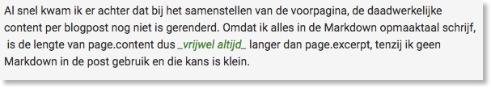

Een kleine irritatie kan soms ineens uitbarsten in de gedachte "Ik ga het nú oplossen". Dat gebeurde me vanavond terwijl ik de voorpagina van deze site bekeek. De blogsoftware Jekyll die ik gebruik, maakt bij het genereren van de pagina's verschillende versies van de blogpost aan. 

Er is een versie genaamd 'page.content' die de volledige inhoud van de blogpost laat zien. En Jekyll maakt een versie 'page.excerpt' die, je raadt het al, een samenvatting van de blogpost laat zien. De voorpagina van mijn site laat standaard een korte samenvatting zien van de blogpost. Die samenvatting kan ik zelf schrijven in de header, maar dat gebeurt niet altijd. Dan valt Jekyll terug naar het weergeven van de eerste paragraaf op de voorpagina. 


Soms zijn mijn blogposts erg kort. Misschien maar één paragraaf. Maar in de template voor de voorpagina werd wel altijd een "Lees verder <i class="fas fa-chevron-circle-right"></i>" tekst getoond, zelfs als de blogpost maar één paragraaf lang was. Je merkt, mijn kleine irritaties kunnen uit allerlei hoeken komen. Ik wilde dat oplossen en vanavond is het me gelukt.

### Excerpt en content vergelijken
Je zou denken dat er een simpele oplossing is: vergelijk de lengtes van page.excerpt en page.content. Als de een korter is dan de ander, dan weet je dat er een "Lees verder" link moet komen. 

Was het maar zo simpel...

Al snel kwam ik er achter dat bij het samenstellen van de voorpagina, de daadwerkelijke content per blogpost nog niet is gerenderd. Omdat ik alles in de Markdown opmaaktaal schrijf, is de lengte van page.content dus _vrijwel altijd_ langer dan page.excerpt, tenzij ik geen Markdown in de post gebruik en die kans is klein. 

Hieronder zie je een screenshot van de vorige paragraaf zoals ik hem schrijf. Die twee underscores zijn Markdown en zorgen er voor dat de tekst schuingedrukt wordt in de uiteindelijke webpagina.



Tegelijk zorgen die twee extra karakters er voor dat de lengte van die paragraaf in page.content langer is dan dezelfde paragraaf in page.excerpt. Dat is vervelend, maar 
gelukkig heeft de onderliggende taal van Jekyll, Liquid, een mooie oplossing. De filter "[Markdownify](https://jekyllrb.com/docs/liquid/filters/)" zorgt er voor dat ik per post op de voorpagina de hele post kan omzetten in een HTML versie. Ik doe dat met

```liquid

```
De markdown code wordt nu een webpagina. Vervolgens kan ik de lengte van page.content en page.excerpt vergelijken. 

```liquid

```

Als bovenstaande waar is zijn de twee ongelijk en is het nodig om een link te tonen naar de volledige post. Als ze gelijk zijn, dan is er dus geen verschil in de samenvatting en de volledige post en is het onzinnig om een "Lees verder" link te tonen. 

Een kleine irritatie die misschien niemand ooit is opgevallen, maar voor nu wel is opgelost. Je kunt [de gewijzigde code trouwens bekijken](https://gitlab.com/frankmeeuwsen/DTD-Blog/commit/e45ea1f97f007624784ad719d260ec3fc0c6e76b#f6013a00b362253c64368d6eebc50ea2131754e2_63_57) in de Gitlab repository. Net als de rest van de code voor deze site. 