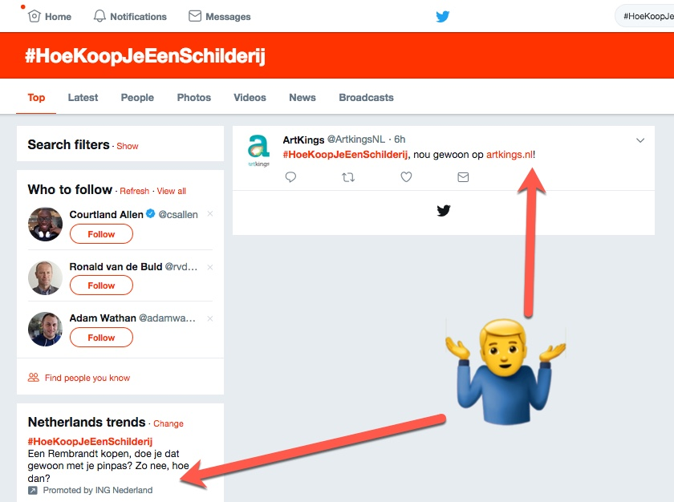

Er zijn momenten dat ik Twitter, of eigenlijk, digitale marketeers echt niet begrijp. Ik zie vanochtend op de Twitter homepage dat ING een Trending Topic heeft ingekocht: #HoeKoopJeEenSchilderij. 

Niet eens een stom idee, want "Hoe dan" vragen doen het altijd goed. Ik klik door op de hashtag en ik zie één tweet. Niet eens van ING, maar van Artkings. Ik zou verwachten dat er een videootje of een blogpost is te vinden waar ING mij uitlegt hoe ik de Nachtwacht kan kopen. Niet met een pinpas blijkbaar, maar hoe dan wel?

Bovenstaande screenshot is het bewijs dat ik echt niets anders zag vanochtend.

En sorry lieve lezers die op basis van de titel hadden verwacht een uitgebreide _how to_ te lezen hoe je adverteert op Twitter. Ik heb daar geen verstand van. Ik adverteer door mijn verhaal te vertellen en mijn stem te laten horen. Meer kan ik niet doen. Misschien is dat wel de beste les dan...