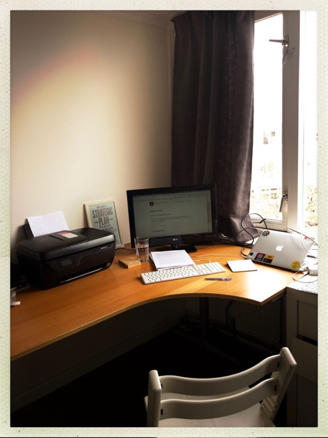

Het heeft wat jaren geduurd (12 om precies te zijn) maar we hebben eindelijk weer een afsluitbare werkplek in ons huis. In ons vorige huis hadden we een extra kamer waar een bureau met onze PC stond, maar na de geboorte van Tess moesten we die uiteraard opgeven. Al die jaren hebben we nooit meer een extra kamer in ons huis gehad. Het huis waar we nu wonen heeft wél die extra kamer, maar die hebben we ingericht als speelkamer voor onze jongste zoon. Niet echt een handige werkplek dus.

Maar we hebben plek weten te maken op onze slaapkamer, waar ik nu in een hoekje een bureau heb gezet. Het bureau vond ik recent voor een paar tientjes bij een garageverkoop in de buurt. We gebruiken nog de oude triptrap stoel van Tess en Finn als eigen bureaustoel en onze vorige TV doet dienst als tweede monitor. Er hangt nog niets aan de muren, de administratie ligt nog beneden en onze boeken zitten nog in dozen. Ik neem nog het externe toetsenbord en trackpad van mijn werk mee. Maar het begin is er. We kunnen eindelijk weer rustig thuis werken en de deur achter ons dicht doen als we ongestoord willen doorwerken. Dat is iets wat ik heel erg heb gemist de afgelopen jaren en ik ben blij dat het nu weer kan. Ik zie er naar uit langzaam maar zeker dit hoekje om te toveren tot een plek waar we weer mooie dingen kunnen maken. 