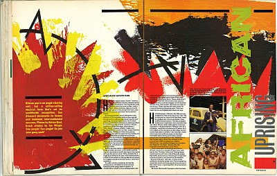
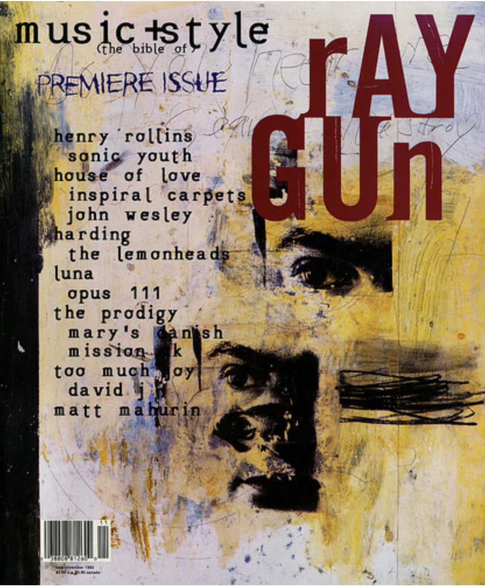

De afgelopen weken heb ik me verdiept in de wat nieuwere mogelijkheden met CSS. Deze bejaarde webwerker komt uit de tijd dat CSS een fonkelnieuwe opmaakwijze op het web was. Een tijd waar layouts werden gemaakt van tabellen en transparante pixel-images. Inmiddels heb ik aan de zijlijn wel wat meegekregen van de nieuwe ontwikkelingen op het gebied van CSS. Pas toen ik [wat meer leerde](https://css-tricks.com/snippets/css/complete-guide-grid/) over de mogelijkheden van CSS Grid werd ik echt enthousiast over de nieuwe kansen voor layouts op het web. Nou ja....nieuw. Het principe van CSS Grid is al [een paar jaar oud](https://hacks.mozilla.org/2015/09/the-future-of-layout-with-css-grid-layouts/). 

Op dit moment werken we aan de nieuwe site van [Olisto](https://olisto.com), waar het nu vooral gaat om op korte termijn een nieuw visitekaartje online te zetten. Dus we kiezen een sluiproute met een template en beproefd framework (WordPress en [Genesis](https://my.studiopress.com/themes/genesis/)) waar we op verder bouwen. Dus ja, we eindigen wel een beetje als [dit voorbeeld](http://adventurega.me/bootstrap/) voor elke website die met Bootstrap of een template is gemaakt.

Maar gaandeweg het ombouwen van het template leer ik over zowel [CSS Flex](https://css-tricks.com/snippets/css/a-guide-to-flexbox/) als CSS Grid. Twee systemen die prima naast elkaar zijn te gebruiken. Elk met hun voor- en nadelen. Ik ben er nog steeds over aan het leren. Door het in de praktijk te gebruiken merk ik snel wat er mogelijk is en word ik erg blij. Want met deze twee flexibele mogelijkheden in de standaard opmaak-taal van het web, zullen ontwerpers en ontwikkelaars dichter naar elkaar groeien. De grid-mogelijkheden maken allerlei nieuwe en verrassende ontwerpen mogelijk, die het ook nog eens goed doen op verschillende schermformaten. Het doet mij denken aan de jaren '90, waar ontwerpers als [Neville Brody](https://nl.pinterest.com/search/pins/?q=neville%20brody%20magazine&rs=guide&term_meta) en [David Carson](https://nl.pinterest.com/search/pins/?rs=ac&len=2&q=david%20carson&eq=david%20car&etslf=6739&term_meta) de grenzen verkenden van magazine-design. Brody voor The Face, Carson voor RayGun. Beiden enorm invloedrijke magazines waar het gaat om design en typografie. Persoonlijk heb ik nog altijd een zwak voor het design van David Carson en RayGun. Ik las en bekeek het magazine gebiologeerd. [Kijk zelf](http://www.cvltnation.com/fuck-yeah-ray-gun-changed-90s-graphic-design/) maar eens naar wat voorbeelden van het magazine. 

Ik hoop dat we in een periode komen waar dit meer en meer voor webdesign zal gebeuren. Niet alleen op basis van frameworks, A/B tests en conversie-maximaliserende growth-hacks. Maar [met gevoel](https://www.smashingmagazine.com/2017/10/css-grid-challenge-2017-winners/) voor art-direction, [gedurfd design](http://www.hi.agency/deck/) en nieuwe paden inslaan. 

Het zet mij wel serieus aan het denken over deze site. Ik ben er nu dik een jaar intensiever mee bezig (er is weer [Blogdrift!](/blogdrift/)) en ik merk dat ik al redelijk de grenzen ontdek van het onderliggende systeem Jekyll en het templatesysteem Liquid. Alles is wel zelf in te bouwen, maar het plugin-ecosysteem van WordPress begint wel erg aanlokkelijk te worden. Ik zit al langer te broeden op een andere indeling van de site, waarbij ik meer de mogelijkheden van CSS Grid [wil ontdekken](https://blog.jmtalarn.com/). In principe moet het niets uitmaken met welk onderliggende systeem ik dat doe. Maar WordPress als systeem is nu eenmaal meer volwassen dan het wat meer DIY principe van Jekyll. De snelheid van platte HTML-pagina's is dan wel weer een heerlijk voordeel van Jekyll ten opzichte van de vele bewegende onderdelen die bij WordPress onder de motorkap zitten. De Indieweb plugins die WordPress ter beschikking heeft (Webmentions, Activitypub etcetera) zijn nog niet klaar om gedachtenloos aan te zetten _en het werkt_. Vaak heeft dat weer een hoop voeten in aarde om het goed werkend te krijgen. 

Vorig jaar heb ik me in de decembermaand de principes van Git meer eigen gemaakt. Ik vermoed dat de komende maand in het teken van de _frontend opmaak_ staan. Eerst ga ik dat proberen met mijn huidige opzet. En anders heb ik weer een mooi project voor een volgende [IndieWebCamp](/indiewebcamp-2018/) of [Homebrew Website Club](https://indieweb.org/Homebrew_Website_Club) ;-)