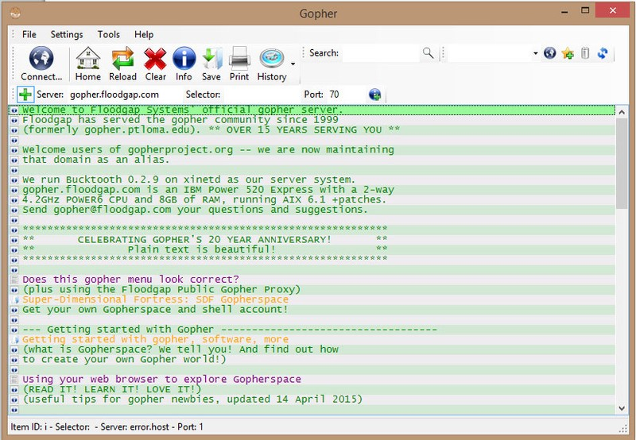

Vandaag staat een bezoek gepland aan de lezing "[Staat van het internet 2019](https://waag.org/nl/event/staat-van-het-internet-2019)", georganiseerd door stichting Waag. Deze stichting is al zo lang ik me kan herinneren actief op het gebied van de sociale en maatschappelijke impact van technologie. Marleen Stikker is bestuurslid bij de stichting en was afgelopen zomer te gast bij Zomergasten, met een indrukwekkend beeld hoe technologie onze maatschappij (ver)vormt. Zie [mijn recensie op Sargasso](http://sargasso.nl/recensie-zomergasten-met-marleen-stikker/) over deze uitzending.

Ik zie erg uit naar de lezing vanmiddag. Niet in de minste plaats door de ophef van de afgelopen dagen rondom het nieuws van KPN en XS4ALL, maar tevens omdat het vandaag 25 jaar geleden is dat De Digitale Stad haar deuren opende (mede dankzij Stikker). Hiermee werd de brug geslagen tussen het vooralsnog wetenschappelijke en academische domein van het internet en het publiek. Ineens kon je met een eigen modem op het internet en kennis maken met gelijkgestemden. 

De [live-uitzending van de start van De Digitale Stad](https://www.youtube.com/watch?v=nCx887IW_wA&feature=youtu.be) kan ik me niet herinneren, maar gelukkig is daar het internet voor :-) Lees meer over de Digitale Stad, wat het was en wat het betekende in [dit NRC interview met Stikker](https://www.nrc.nl/nieuws/2019/01/14/we-moeten-het-internet-heroveren-a3629072). 

Voor mij was DDS eveneens een eerste kennismaking met het internet. Tijdens een stage op de Hogeschool Den Bosch in 1993 had ik al onderzoek gedaan naar het gebruik van email als communicatiemiddel tussen studenten en docenten. Ik pendelde tussen de communicatie-afdeling waar ik officieel zat, en de IT afdeling, om zelf gebruik te kunnen maken van email, om via Gopher online naar documenten te zoeken. Gopher was [een tekstgebaseerd protocol](https://howwegettonext.com/gone-gone-gopher-the-other-world-wide-web-that-almost-was-73eebcc28d3d) om op het web te browsen. Browsers zoals we die nu kennen waren er nog niet. 

Met vrienden [Ronald van Schaik](https://www.emerce.nl/interviews/kaliber-gebruik-innerlijke-tommy) en [Martijn Verhoeven](https://www.linkedin.com/in/mdverhoeven/) ontdekte ik De Digitale Stad, een veel makkelijker manier om online te gaan en om het web te verkennen. Sindsdien was er geen houden meer aan. We besloten tijdens onze studie dat we alleen nog maar via het web en email zouden communiceren, tot afgrijzen van onze docenten. Onze afstudeeropdrachten hadden altijd een sterk online component en daarna zijn we allemaal in de online industrie gaan werken, eerst met een eigen bureau en vervolgens zijn we alle kanten uitgewaaierd.

Hoe staan we er na 25 jaar voor? Het zal zeker geen enorm positief verhaal worden, maar ik verwacht in elk geval nuance, goed debat en wat scherpe vooruitzichten wat we als publiek beter en anders kunnen doen de komende jaren. 

De lezing vanmiddag is uitverkocht maar je kunt vanaf 15:30 uur meekijken met [de livestream](https://vimeo.com/310786958). 