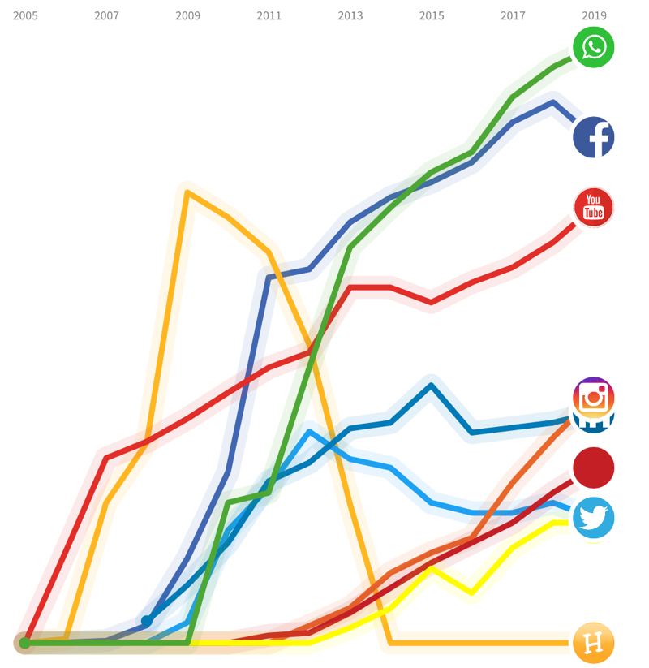

Vandaag maakt Newcom bekend dat het aantal Nederlandse Facebookgebruikers daalt. En fors. Zo'n 640.000 gebruikers minder, [aldus het AD vandaag](https://www.ad.nl/tech/honderdduizenden-nederlanders-verlaten-facebook~a45abf39/).

6% daling in een jaar tijd. Dat is best flink te noemen. Het zou nog interessanter zijn om te zien wanneer deze dalingen inzetten. Bijvoorbeeld na het Cambridge Analytica schandaal en de oproep van onder andere Arjen Lubach? Of is het omdat jongeren afscheid nemen van het platform en zich richten op Instagram en andere nieuwe online plekken? 

## Nieuwe online oase's
Tegelijkertijd stijgt inderdaad het aantal Instagram gebruikers, evenals voor Whatsapp. Je kunt er vergif op innemen dat de advertentiedruk op deze platforms zal toenemen om te blijven voldoen aan de druk van aandeelhouders en groei binnen het concern. Wat dit voor gevolgen heeft de komende jaren is afwachten. Zuckerberg heeft al [te kennen gegeven](https://www.bbc.com/news/technology-47001460) dat hij de chat-functionaliteiten op de drie platformen interoperabel wil maken. Met je Instagram account kun je dan iemand op Whatsapp of Facebook messenger bereiken. Enorm handig en het biedt natuurlijk mogelijkheden voor adverteerders om multi-platform bereikbaar te blijven zonder overhead in beheer, configuratie en accounts. 

Het is vanuit een commercieel oogpunt begrijpelijk dat Facebook BV besluit om deze interoperabiliteit binnen de eigen blauwe muren te houden. Kijkend naar het open web en de keuzevrijheid die we als consument zo graag willen, dan zou Facebook net zo goed [het Activitypub protocol](https://bouwenaanbeter.nl/2019/01/onafhankelijke-informatie-uitwisseling-met-activitypub/) kunnen omarmen. Een technisch protocol wat _exact_ hetzelfde doet, maar tegelijkertijd een veel breder ecosysteem van platformen, apps en mogelijkheden openstelt. 

Maar ja, dan is het gevaar dat Facebook gebruikers andere online oase's ontdekken waar vrienden en netwerken zitten, waar meer waarde is te vinden dan op Facebook zelf. Met alle gevolgen van dien. 

## Dansende banaan
De daling van Facebook is ingezet door het falende beleid van het netwerk zelf. De daling kan volgens mij doorgezet worden als alternatieven en nieuwe initiatieven bereikbaar en beschikbaar komen voor een groter publiek. Op dit moment zijn allerlei Indieweb en Decentrale Web projecten té technisch van aard en vereisen ze een te groot offer in tijd en energie voor de dagelijkse online consument om mee te starten. Niet in de minste plaats vanwege het argument "maar al mijn vrienden zitten op...". Dat is een lastig maar geen onmogelijk argument. Er was een tijd dat we collectief op Hyves elkaar dansende bananen stuurden of pijn aan je retina kreeg van de MySpace layouts. 

Ik geloof dat die tijd weer kan komen. Niet per sé van de dansende bananen (al zou dat wel leuk zijn) maar wel een breder en divers landschap van platformen en ecosystemen. Waar we elkaar kunnen vinden, met elkaar kunnen communiceren en waar niet pertinent een derde partij allerlei data van ons nodig heeft óm met elkaar te kunnen communiceren. 

Laten we dat gaan doen. 

Photo by [Patrick Tomasso](https://unsplash.com/photos/KGcLJwIYiac?utm_source=unsplash&utm_medium=referral&utm_content=creditCopyText) on Unsplash

