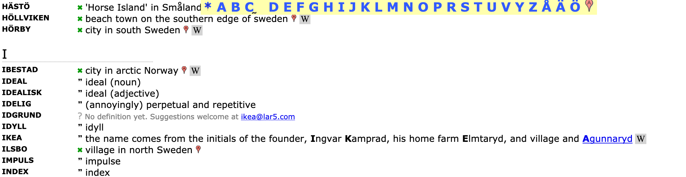
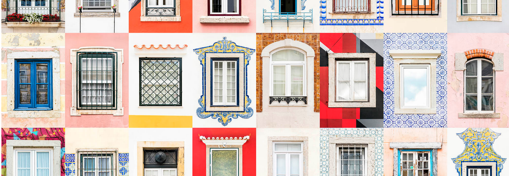

Een grote aantrekkingskracht voor het web zijn de niches waar je je thuis kunt voelen. Voor elke niche-hobby is wel een site te vinden en hopelijk een bijbehorende community. Wat mij nog meer boeit is dat veel van die niches vrij toegankelijk zijn. Ik kan uren rond dwalen op persoonlijke homepages en blogs die heel specifiek inzoomen op één onderwerp of hobby. Ik vind het fascinerend dat er tijd en energie in wordt gestoken. Niet om een groot publiek te bereiken, maar om een eigen doel te bereiken. Om je eigen verhaal te vertellen, je eigen _itch_ te _scratchen_ of gewoon, omdat het leuk is en het kan. 
Drie voorbeelden die me deze middag bezighielden:

**Video games skies**. Is het niet heerlijk om rond te struinen over een site waar je alleen maar [screenshots ziet van de wolkenluchten, regenbuien en zonsondergangen die in videogames worden gebruikt](https://videogamesskies.tumblr.com/)? Het is toch prachtig om direct een spel uit je jeugd te herkennen, of je af te vragen hoe de maker het screenshot heeft gemaakt? 

**Het IKEA woordenboek**. Volgens mij is de site al een tijdje niet meer aangevuld. Ik mis bijvoorbeeld onze KALLAX kasten en de STRANDMON fauteuil die zo heerlijk zit. Maar verder is het [IKEA verklarend woordenboek](https://lar5.com/ikea/) een fijne hulp op verjaardagen en kroeg-weddenschappen over de herkomst van een IKEA productnaam.

**Windows of the world**. Een verzameling is geslaagd bij de gratie van de maker. Als je besluit om de [ramen van een stad te fotograferen](https://www.andrevicentegoncalves.com/photography-project/windows-of-the-world-collections) en deze op een manier te ordenen en presenteren, dan is het de kunst om de ziel van een stad terug te laten komen in de collectie. Al bladerend door de fantastische collages van fotograaf André Vicente Gonçalves herken je direct de ramen van Parijs. Zelfs die van Amsterdam. De ramen van Rotterdam verraste me. Een weergaloze verzameling van vensters in allerlei steden. Salontafelboekwaardig!

