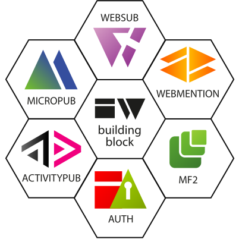
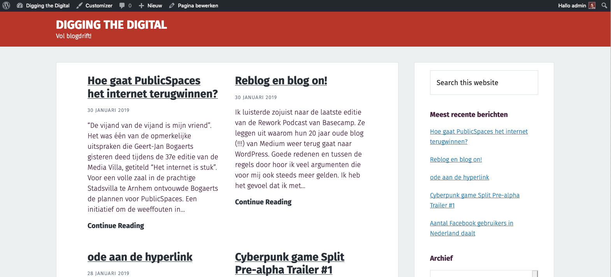

Met wat korte [tussenpozen](https://diggingthedigital.com/verhuisupdate/) ben ik bezig om deze site naar een volgend niveau te brengen. Wat ooit begon als een hobby-project om [Jekyll en Github](/Playing-with-Git-again/) meer eigen te maken, is uitgegroeid tot een blogarchief van het verleden en heden. 

## Bouwstenen
Het was oorspronkelijk niet de bedoeling dat deze site een archief zou krijgen en ik had niet verwacht dat ik steeds specifiekere wensen zou krijgen rondom het beheer en de presentatie van de site. Nou ja, dat laatste misschien wel. Als je eenmaal bezig bent wil je altijd meer. Mijn interesse in het Indieweb en de bijbehorende bouwstenen maakte me eveneens nieuwsgierig. Wat zou ik zelf kunnen doen, wat is er al beschikbaar als een klik-en-klaar script? 
Dat blijkt in de praktijk nog [vies tegen te vallen](https://diggingthedigital.com/wijziging-van-de-verhuisplannen/). Er zijn zeker genoeg scripts en code op Github te vinden die je op weg kunnen helpen in de wereld van het indieweb. Denk aan webmentions en micropub, respectievelijk de mogelijkheid om reacties uit te wisselen met andere sites in plaats van reactieformulieren en de optie om met een groeiende verzameling van apps en extensies op je eigen site te posten. 

Het werkt allemaal wel, maar net niet lekker genoeg. Net niet zoals ik het zou willen. Ik moet er zelf nog te veel aan sleutelen en echt diep onder de motorkap kijken wat er allemaal aan de hand is en wat ik moet verbeteren. Ik ben geen programmeur, maar ik ben niet bang om wat te leren. De laatste weken was ik meer tijd kwijt met het fixen van code-problemen dan met het schrijven op mijn blog en het plezier van het delen van toffe dingen hier. Zeker toen ik bezig was met de eerste stappen om mijn blog te verhuizen, kwam ik probleem op probleem tegen. Om een probleem op te lossen, moest ik eerst weer een andere hobbel over die voor een nieuw probleem zorgde. Zo ging het maar door. Ik was meer aan het programmeren dan aan het schrijven. 

## WordPress en Genesis
Dat was het definitieve teken dat er iets moest veranderen. De wijzer moest weer naar het schrijven en publiceren doorslaan. Ik vind het niet erg om zo nu en dan de mouwen op te stropen en wat code naar mijn eigen hand te zetten. Maar ik wil er vooral ook over kunnen schrijven en het kunnen delen. Na een weekend problemen oplossen had ik daar niet altijd meer zin in. 

Wat is dan een goede oplossing? Eigenlijk had ik daar de afgelopen maanden al veel mee gewerkt bij Olisto. Samen met [Patrick Loonstra](https://www.patrickloonstra.nl/design/olisto/) heb ik de website een nieuw jasje gegeven, zowel aan de voorkant als in het WordPress beheer. We maakten gebruik van het [Genesis framework](https://www.studiopress.com/features/) met een zogenaamd _child theme_. De relatie tussen deze drie kan ik het beste uitleggen met een auto-analogie: WordPress is de motor van de auto, Genesis is de carrosserie en het eigen child theme is de lak, accessoires en het uiterlijk van de auto. Genesis geeft extra functionaliteiten boven op WordPress waardoor het aanpassen en eigen maken van een child theme weer eenvoudiger wordt. Genesis maakt van WordPress direct een meer flexibel CMS. 

## WordPress en Indieweb
Ik ben op dit moment bezig om de ongeveer 1000 blogposts lokaal te importeren in een WordPress blog en deze met Genesis en een child theme weer presentabel te maken. Dit is met [een plugin](https://nl.wordpress.org/plugins/import-xml-feed/) en wat [slimme Jekyll/Liquid code](https://github.com/frankmeeuwsen/DTD-Blog/blob/master/all.xml) redelijk snel te doen. 
Maar wat me écht blij maakt is de mogelijkheid om in WordPress [diverse Indieweb bouwstenen](https://wordpress.org/plugins/indieweb/) weer te gebruiken. En vooralsnog werken ze na installatie prima. Ik ga bij Ton nog spieken hoe hij de [webmentions met microformats](https://www.zylstra.org/blog/2018/11/mapping-microformats-to-this-site/) voor elkaar heeft gekregen en ik zal nog wel _iets_ zelf aan moeten passen in het child theme. Maar ik verwacht daar geen onoverkomelijke problemen. Ik begin met een child theme wat voor mij presentabel genoeg is, daarna ga ik dat verder tweaken naar mijn eigen wensen. Dat zit vooral in de presentatielaag. Daar ben ik beter in thuis dan de combinatie presentatie en beheercode. Belangrijke elementen voor een site ontwerp zijn voor mij hoe het mobiel werkt en hoe snel de site wordt getoond. 

## En Jekyll dan?
Betekent dit het einde van mijn avontuur met Jekyll? Voor dit blog wel. Ik merk dat ik de grenzen heb bereikt in wat ik kan en wil doen op technisch niveau. Jekyll en statische site generatoren zijn prima voor relatief kleine en eenvoudige blogs die weinig eisen hebben. Maar als je verder wilt professionaliseren heb je een goede programmeur naast je nodig, een diepere kennis van zowel Jekyll als Ruby, de onderliggende programmeertaal. 
Ik zal Jekyll zeker blijven gebruiken voor kleinere projecten en aanbevelen waar nodig. 

Adieu Jekyll, welkom WordPress!