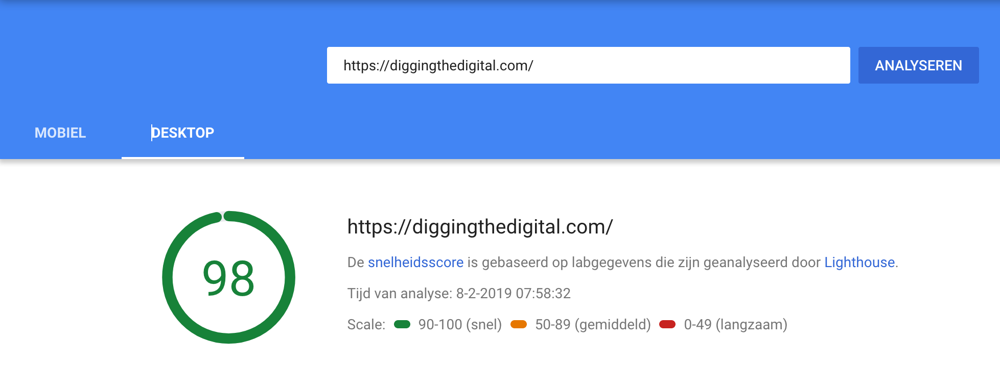
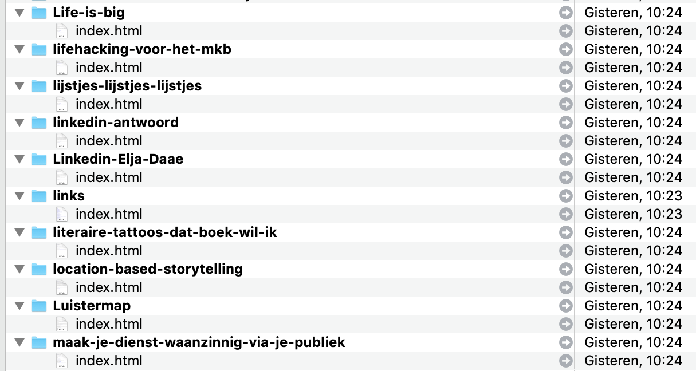
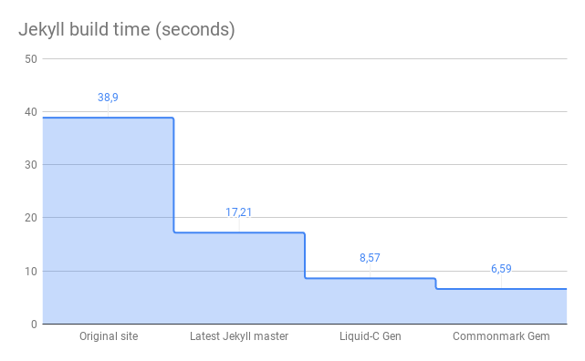

Dat zul je altijd zien. Heb ik eindelijk [de knoop doorgehakt](https://diggingthedigital.com/verhuisupdate-wordpress/) om deze site om te zetten van Jekyll naar WordPress, kom ik een nieuwe blogpost tegen die een van mijn bezwaren bij Jekyll wegneemt. 

## Snelheid
De hoeveelheid posts is toegenomen sinds ik een archief van oude blogs heb omgezet naar dit domein. Met Jekyll maak ik zogenaamde statische pagina's. Dat betekent dat elke blogpost, elke pagina op deze site, een op zichzelf staande pagina is. Er komt niet uit een database, er wordt niets opgebouwd vanuit een server, zoals bijvoorbeeld bij WordPress. Dit heeft snelheidsvoordelen aan de kant van de lezer. Het Spartaanse uiterlijk van de site, weinig franjes, weinig toestanden, zorgt er voor dat de site enorm snel is volgens de [Google PageSpeed Insights](https://developers.google.com/speed/pagespeed/insights/?url=https%3A%2F%2Fdiggingthedigital.com%2F&tab=mobile).

Om dit mogelijk te maken, wordt de site op de server in zijn totaliteit opgebouwd en als losse HTML bestanden gepubliceerd. Zo krijgt elke blogpost zijn eigen folder met een index pagina. Die index-pagina is wat je uiteindelijk als lezer ziet. Het blogplatform Jekyll maakt dit mogelijk. Een groot voordeel is dat je deze site op elke willekeurige webserver kunt serveren. Ik hoef er in theorie niets extra's voor te installeren. It just works....

Er zijn echter wel wat nadelen. Met de groei van de site neemt de bouwtijd na elke wijziging behoorlijk toe. Jekyll is namelijk zo geprogrammeerd dat bij een wijziging in een blogpost, de complete site opnieuw wordt opgebouwd. Omdat elke pagina bestaat uit de inhoud en een template waar die inhoud in wordt getoond. Content en vormgeving. 

Jekyll heeft wel wat slimmigheden om die bouwtijd te verkorten, zoals de zogenaamde _incremental build_. Hiermee wordt de bouwtijd al aanzienlijk verkort. Maar in mijn geval bleef het een frustratie, omdat de bouwtijd soms echt in de minuten liep. Dat vertraagt voor mij de flow van even wat schrijven en publiceren. 

## Versnel Jekyll
Ik kwam gisteren [een blogpost tegen](https://forestry.io/blog/how-i-reduced-my-jekyll-build-time-by-61/) met een experiment om Jekyll te versnellen. De auteur maakt gebruik van functies die in een nieuwe versie van Jekyll zullen verschijnen, zoals caching en een snellere conversie van de Markdown opmaaktaal naar HTML webtaal. Met een paar kleine stappen wist hij de bouwtijd van zijn site met 61% te versnellen. Dat is indrukwekkend. Ik besloot lokaal het experiment uit te voeren om te zien wat er bij mij zou gebeuren. Dat was minstens zo indrukwekkend mag ik wel zeggen. De bouwtijd van mijn blog is met slechts de 3 eerste stappen al met 83% gereduceerd! Van 38,9 seconden naar 6,6 seconden. 

De verbeteringen die de auteur doorvoert zijn nog niet goed te gebruiken op een live productiesite, zeker omdat hij gebruik maakt van een vroege versie van de nieuwe Jekyll. Deze stap alleen al versnelt het bouwproces met 55% en het lost één frustratie van het proces op. Het betekent wel dat ik deze site naar een andere hostingpartij moet brengen vanwege de plugins die er worden gebruikt in de vervolgstappen. 

## WordPress wint het toch
Maar het lost niet het grootste probleem voor me op, ik wil graag stappen zetten in het gebruik van de bouwstenen van het Indieweb. Ik word hier echter gehinderd in een gebrek aan kennis en inzicht hoe ik dit zelf kan doen. Zeker in een omgeving als Jekyll is dit wel nodig. Bij WordPress zijn er al betere plugins die goed werken als je ze installeert. Daarbij zijn er eveneens stappen in de WordPress community om een statische site te presenteren aan de voorkant in plaats van een volledig dynamische pagina, zoals nu gebeurt. 

Maar gebruik je Jekyll en heb je een behoorlijk archief, dan is [deze blogpost](https://forestry.io/blog/how-i-reduced-my-jekyll-build-time-by-61/) zeker de moeite waard om te leren hoe je de snelheid nog verder kunt verbeteren. 