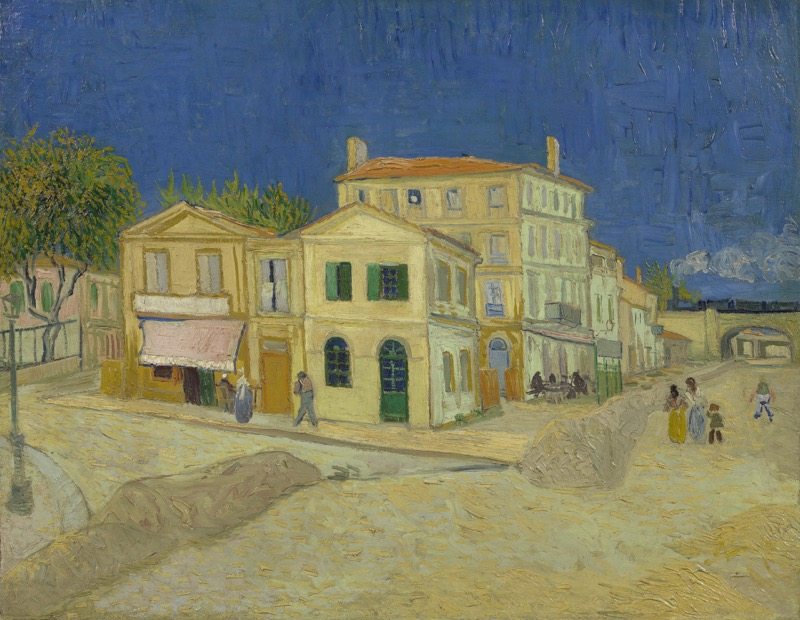
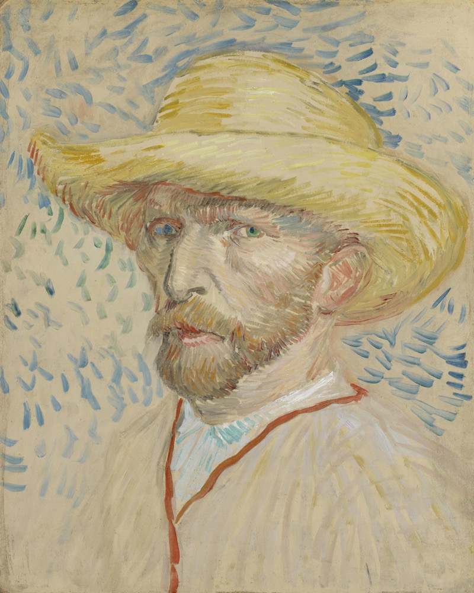
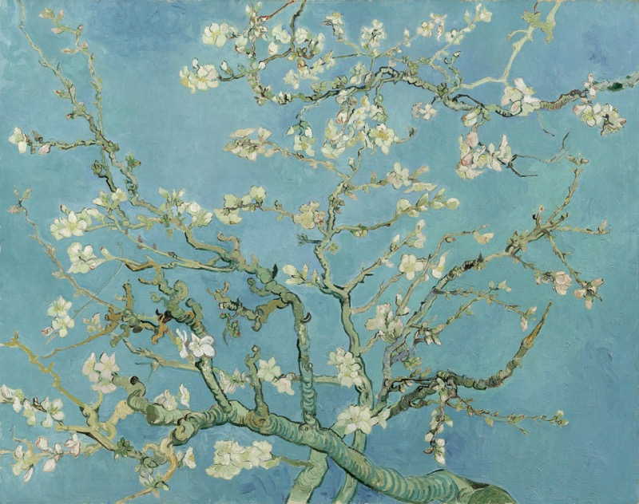

Camille was de elfjarige zoon van een postbode in een klein dorpje in het zuiden van Frankrijk. Op een dag zag hij een ietwat vreemde man van de trein stappen, waar hij elke dag zijn vader hielp om de post uit te laden. "Ik ben Vincent, een schilder", vertelde de man hem, en hij kwam in het gele huis tegenover de jongen te wonen. Om de mooiste doeken uit zijn korte carriére te schilderen.

## Gele huis

Vandaag hoorde ik voor het eerst over Camille, de jonge vriend van Van Gogh. We waren voor het eerst in het Van Gogh Museum. Ondanks dat je zijn beroemde doeken kent. Ik zag ze op TV, het web, in tijdschriften of in het voorbij gaan op allerlei afdrukken. De overweldigende ervaring om een aantal van zijn schilderijen in levende lijve te zien. Om er vlakbij te staan en de dikke lagen verf op het doek te zien. Dat is altijd magisch. 

Bovenstaande schilderij, het gele huis waar hij met zijn vriend Gaugin woonde. Ik had het al wel vaker gezien. Maar toen ik er vandaag voor stond en met eigen ogen de kleurexplosie zie in het blauw en geel, dat is iets wat je echt zelf moet ervaren.

## Zelfportret

Dit zelfportret uit 1887 is niet zo groot. Het is op [karton geschilderd](https://www.vangoghmuseum.nl/nl/collectie/s0164V1962) waardoor de originele paarse ondergrond verloren is gegaan. Maar de manier waarop het is geschilderd, de schijnbaar achteloze strepen waarmee hij een sfeer en een gevoel brengt. Die dieprode kleur in de biezen en zijn verschillend gekleurde ogen. Het heeft me direct diep geraakt en niet meer losgelaten. Een instante favoriet. 

> "Het is een kwestie van stijl toevoegen"

Deze zin bleef bij me hangen terwijl ik keek naar zijn schilderij "[Kreupelhout](https://www.vangoghmuseum.nl/nl/collectie/s0051V1962)", wat hij schilderde terwijl hij in de inrichting in Saint-Rémy verbleef. Een prachtig doek. De zin komt uit [een van de vele brieven](http://vangoghletters.org/vg/letters/let776/letter.html) aan zijn broer Theo. Deze brieven zijn in een fabuleuze online database terug te lezen, inclusief schetsen, de originele teksten en voetnoten. Wat Van Gogh in zijn hele carrière deed was toch wel iets meer dan "stijl toevoegen". Hij laat ons de wereld door zijn ogen zien. Via zijn handen en de verf kwamen zijn diepste gevoelens en donkerste emoties naar buiten. Van de groene luchten onder het golvende koren in het [Korenveld met maaier](https://www.vangoghmuseum.nl/nl/collectie/s0049V1962) tot de felle blauwe kleuren in de [amandelbloesem](https://www.vangoghmuseum.nl/nl/collectie/s0176V1962).

Na het bezoek van vandaag besef ik me hoe weinig ik eigenlijk weet over één van onze meest beroemde schilders. Hoe intens het kan zijn om oog in oog te staan met zijn werk en wat een indruk het achterlaat. Zowel zijn schilderwerk als zijn levensverhaal.

## Credits
De volledige collectie van Van Gogh is terug te vinden op de site van het museum. Bovenstaande reproducties zijn gratis te downloaden en te gebruiken voor niet-commercieel gebruik met vermelding van de volledige credits

**Het Gele Huis (De straat)** Arles, september 1888 (olieverf op doek, 72 cm x 91.5 cm) Van Gogh Museum, Amsterdam (Vincent van Gogh Stichting) 

**Zelfportret met strohoed**, Parijs, augustus-september 1887 (olieverf op karton, 40.9 cm x 32.8 cm) Van Gogh Museum, Amsterdam (Vincent van Gogh Stichting) 

**Amandelbloesem**, Saint-Rémy-de-Provence, februari 1890 (olieverf op doek, 73.3 cm x 92.4 cm) Van Gogh Museum, Amsterdam (Vincent van Gogh Stichting) 
