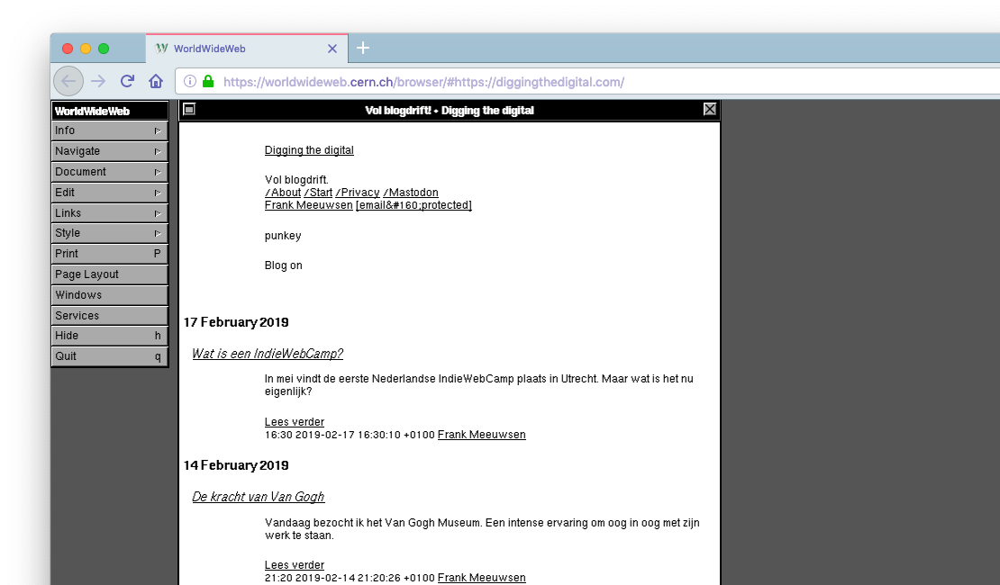

Graven in digitale schatkisten, ik hou daar van. Niet voor niets schreef ik ooit [Bloghelden](https://www.bloghelden.nl) en vertelde ik in de [podcast met Erno Hannink](/online-pionieren-als-werknemer-of-als-ondernemer/) waarom ik het belangrijk vind om zo nu en dan naar het verleden te kijken. Om daar weer van te leren voor de toekomst. 

Dus toen ik vanochtend over het WorldWideWeb project las, maakte mijn hart wel een sprongetje. Jeremy Keith is een van de initiatiefnemers om de allereerste web browser ooit weer werkend te krijgen. En het is ze nog gelukt ook. De browser genaamd [WorldWideWeb](https://worldwideweb.cern.ch/browser) is door een team van programmeurs, designers en bouwers weer opgelapt en teruggebracht in de staat zoals deze begin jaren '90 op de markt kwam. De browser is geen losse app, je gebruikt hem als [een Javascript applicatie ín je browser](https://worldwideweb.cern.ch/browser). Ik kan je aanraden dit wel op een desktop of laptop te doen, ik denk dat het mobiel niet echt goed zal werken.

Op dit moment lijkt de site plat te liggen, vermoedelijk door internationale aandacht of sites als Reddit en Hacker News. Dus geef het wat tijd. Aan de andere kant, zo was het internet nu eenmaal mensen! Dan was de verbinding weg, moest je weer inbellen, deed de website het niet, had de schoonmaakster de stekker van de webserver er even uitgetrokken om te stofzuigen. 

De browser werkt anders dan je nu gewend zou zijn van Firefox of andere browsers. Zo moet je dubbelklikken op links en is er niet een duidelijke adresbalk. Tip: Ga in het linkermenu naar Document > Open from full document reference en typ de URL in die je wilt zien. Deze blog ziet er trouwens nog verdomd leesbaar uit in zo'n oude browser!

Voor meer achtergrond informatie verwijs ik je naar [de blogpost van Jeremy](https://adactio.com/journal/14821) en de [waanzinnig interessante achtergrond-artikelen](https://worldwideweb.cern.ch/code/) bij CERN zelf. 
Check vooral bij Jeremy de uitleg hoe deze browser zowel voor consumptie (browsing) als productie (editing) was. Je maakte _in_ de browser de documenten waar je dan later weer naar kon linken. Zo kon je de browser gebruken om naar je eigen documenten op je lokale harddisk te linken, maar eveneens naar pagina's op de rest van het netwerk. 

Veel speelplezier!